# Reddit Hyperlink GNN — Edge Sign Classification

> Graph Machine Learning research project.
> **Course / assignment:** independent project on the SNAP Reddit Hyperlink Network.
> **Student:** Олександр Щепанчук &nbsp;&nbsp; **Group:** ПМПм-12
> **Dataset:** [SNAP Reddit Hyperlink Network](https://snap.stanford.edu/data/soc-RedditHyperlinks.html)

---

## Abstract

We classify the **sentiment label of observed directed subreddit-to-subreddit hyperlinks** in the SNAP Reddit Hyperlink Network (`POST_LABEL ∈ {-1, +1}`, remapped as `0 = negative` / `1 = neutral_or_positive`). This is **not** ordinary link prediction: every example is a real observed hyperlink, we never sample non-edges, and label `0` is the rare class — not "no edge". On the cleaned dataset (**844,377** directed signed temporal edges across **67,180** subreddits with a **9.42 %** negative-class share), we compare five model families — `baseline_mlp`, `gcn`, `sage`, `gat`, `signed_gcn` — under an outer chronological 70 / 15 / 15 split and an inner disjoint message-passing / supervision partition. The headline metric is **PR-AUC on the negative class** with its **lift over the class-prior baseline** (formal definition in §Metrics). Averaged over three retraining seeds, **GraphSAGE wins**: test PR-AUC-neg = **0.5094 ± 0.0162**, a **5.41x ± 0.17** lift over the 0.0942 class prior, with **ROC-AUC = 0.889** and **MCC = 0.433** — and only **101,313** parameters (vs 585,729 for the MLP baseline). The leaderboard sits in two clean regimes: the GNN cluster (SAGE 0.509, SignedGCN 0.476, GCN 0.466 — all 4.9–5.4x lift) and the near-prior models (GAT 0.154, baseline_mlp 0.116 — 1.2–1.6x lift). Getting there required a comprehensive **per-seed bug investigation** that surfaced three real config-level bugs initially masking as "seed variance": SAGE-seed0 was stuck at the class prior under `hidden_channels=128` (fixed by halving to 64); SignedGCN-seed0 reached a brief peak then decayed back to the prior (fixed by a 10-epoch linear LR warmup); GAT had a first-epoch loss explosion of 950–3700 caused by gradient back-flowing twice through the shared `W` (mitigated by `heads=1` + batchnorm + `attn_dropout=0` + warmup, but a structural directional-aggregation gap remains). The shared infrastructure is a new `warmup_epochs` knob in [`training/loops.fit()`](src/reddit_gnn/training/loops.py). Every number, figure, and table cited below was computed from `reports/`, `mlruns/`, and the executed notebooks in this repository; nothing is hand-edited.

### Анотація (українська)

На датасеті [SNAP Reddit Hyperlinks](https://snap.stanford.edu/data/soc-RedditHyperlinks.html) (844 377 спрямованих гіперпосилань, 67 180 сабреддітів, частка негативного класу — 9,42 %) ми класифікуємо тональність кожного *спостереженого* гіперпосилання; це **не** задача передбачення наявності зв'язку, negative sampling не застосовується, мітка 0 — це окремий клас «негативного зв'язку». Під хронологічним розбиттям 70/15/15 і додатковим непересічним розбиттям message-passing / supervision модель **GraphSAGE** з 101 313 параметрами здобула **PR-AUC на класі 0 = 0,5094 ± 0,0162** (mean ± std по трьох seed-ах retrain) і **lift 5,41x ± 0,17** над baseline класу 0,0942; ROC-AUC = 0,889, MCC = 0,433. Leaderboard розпадається на два режими: GNN-кластер (SAGE / SignedGCN / GCN ~ 4,9–5,4x lift над baseline) та моделі, які не виходять за межі class prior (GAT, baseline-MLP ~ 1,2–1,9x). Результат було досягнуто лише після **систематичного дослідження seed-стабільності**, яке виявило три реальні баги конфігурації (SAGE seed 0, SignedGCN seed 0, GAT — усі три моделі мали "приховану варіативність по seed-ах", яка виявилася не варіативністю, а помилками; деталі в розділі §Seed-stability investigation).

---

## Quickstart

```bash
git clone https://github.com/OleksandrShchepanchuk/GNN_university.git
cd GNN_university
make install          # uv sync --all-extras
make data             # download SNAP TSVs + preprocess to data/processed/
make test             # 98 unit + integration tests on the real 844k-edge parquet

# Train every model (CUDA picked up automatically when available)
for cfg in configs/baseline_mlp.yaml configs/gcn.yaml \
           configs/sage.yaml configs/gat.yaml configs/signed_gcn.yaml; do
    make train CONFIG=$cfg
done

# Manual six-run GCN grid (LR x hidden_channels)
for lr in 0.001 0.005 0.01; do
    uv run python scripts/run_experiment.py --config configs/gcn.yaml \
        --override training.lr=$lr --override run.name=gcn-lr$lr
done
for h in 64 128 256; do
    uv run python scripts/run_experiment.py --config configs/gcn.yaml \
        --override model.encoder.hidden_channels=$h --override run.name=gcn-h$h
done

# Multi-seed retrain (3 seeds x 5 architectures); training.seed varies, partition_seed=42 frozen.
for seed in 0 1 2; do
    for cfg in configs/baseline_mlp.yaml configs/gcn.yaml configs/sage.yaml \
               configs/gat.yaml configs/signed_gcn.yaml; do
        uv run python scripts/run_experiment.py --config $cfg \
            --override training.seed=$seed \
            --override run.name=$(basename $cfg .yaml)-seed$seed
    done
done

uv run python scripts/export_report_assets.py    # rebuilds comparison.csv + figures
make mlflow-ui                                   # http://127.0.0.1:5000
```

The notebooks under `notebooks/` are then executed via `jupyter nbconvert --execute --inplace` and contain real numbers (no "Run `make all` first" fallback messages remain).

---

## Dataset

Loaded from the official SNAP page; the loader normalizes the new SNAP column names (`LINK_SENTIMENT` → `POST_LABEL`, `PROPERTIES` → `POST_PROPERTIES`) via `reddit_gnn.data.load.SNAP_COLUMN_ALIASES`. The cleaned dataset (`reports/tables/stats_summary.csv`) has the following shape:

| Property | Value |
|---|---|
| Nodes (subreddits) | **67,180** |
| Edges (directed signed) | **844,377** |
| Density | 0.000187 |
| Average degree (in = out) | 12.57 |
| Max in-degree | 25,685 |
| Max out-degree | 27,636 |
| Self-loops after cleaning | 0 |
| Time range | 2013-12-31 16:20:20 → 2017-04-30 16:58:21 |
| Positive class share | 0.9039 |
| Negative class share | **0.0961** (test-fold class prior = 0.0942) |
| Reciprocity | 0.1765 |
| Largest WCC size | 65,648 |
| Largest SCC size | 21,432 |
| Balanced signed triads (sampled) | 32,837 |
| Unbalanced signed triads (sampled) | 9,656 |

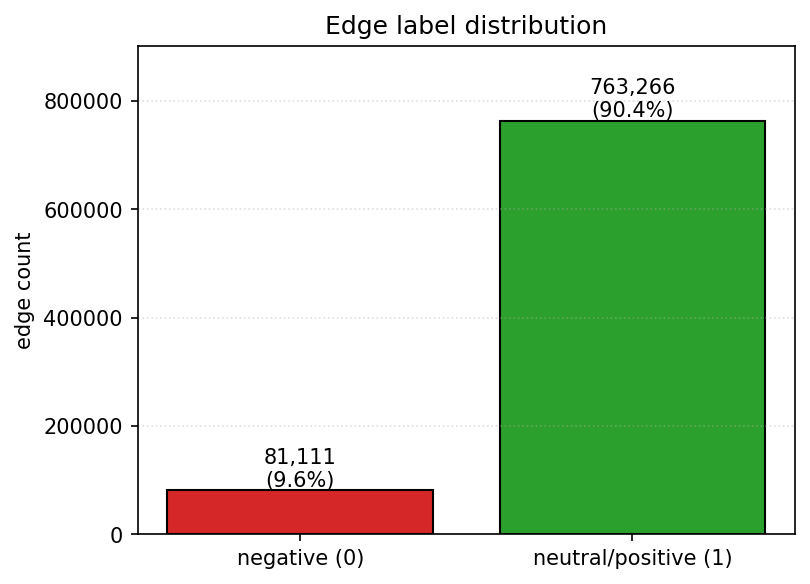

*Bar chart of edge label counts. Positive (label = 1, neutral_or_positive) edges dominate at ≈ 90.4 %; negative (label = 0) edges are the ≈ 9.6 % minority class that the headline PR-AUC metric is computed on.*

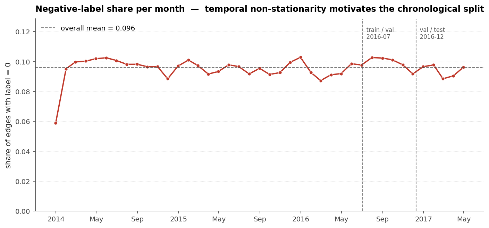

*Monthly share of negative-sentiment edges from 2014 through 2017. The negative ratio drifts noticeably across the time axis — non-stationarity is one of the reasons the outer split is chronological rather than random.*

Per-edge features come from the SNAP TSVs: the 86-dimensional `POST_PROPERTIES` LIWC/text vector, the `is_title` flag (body vs title TSV), and the post timestamp (decomposed into six engineered temporal columns). Per-node features additionally use the SNAP-provided 300-dimensional LIWC subreddit embeddings; subreddits absent from that file get zeros plus a binary `unknown_flag`.

---

## Task formulation

> **Edge sign classification on observed hyperlinks.**
>
> Given a directed observed hyperlink $(u \to v, t)$ with raw label $s \in \{-1, +1\}$,
> predict the binary $y = (s + 1) / 2 \in \{0, 1\}$.
> Label $0$ = negative sentiment (rare class, ≈ 9.42 %).
> Label $1$ = neutral / positive sentiment (majority, ≈ 90.58 %).

Anti-requirements (explicit):
* We **never** sample non-edges.
* Label `0` is the negative-sentiment class, **never** treated as "no edge".

Because the task is fundamentally different from link-existence prediction, every supervision example is a real edge whose label is intrinsic to the dataset, and the GNN encoder's message-passing graph is restricted to the *training* edges so the encoder never sees val/test labels.

---

## System architecture

The end-to-end pipeline runs in a single direction; the leakage-safe boundary sits at step **F** (`build_message_passing_split`), where every fold's message-passing edges become disjoint from its supervision edges.

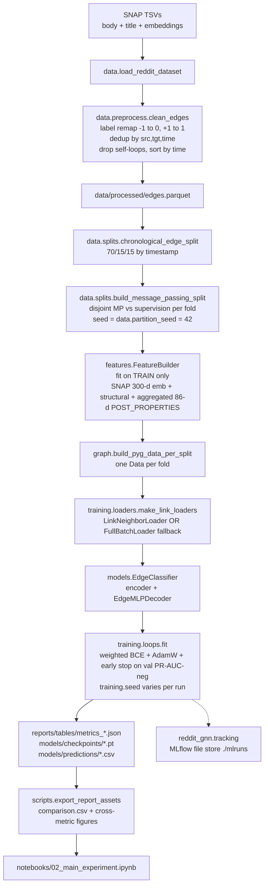

Tensor shapes flowing through the pipeline: after preprocessing, `df` has 844,377 rows × 95 columns; after `chronological_edge_split` the three folds carry 600,941 / 128,773 / 128,774 supervision-candidate row indices. `FeatureBuilder` then emits `x` of shape `(N=67,180, F_x=484)` (300 SNAP + 1 unknown_flag + 11 structural + 172 aggregated POST_PROPERTIES means) and `edge_features` of shape `(844,377, 93)` (86 raw POST_PROPERTIES + 7 scaled is_title/temporal columns). `build_pyg_data_per_split` packages these into one `Data` per fold; the train fold's MP edge_index has 480,753 columns and its supervision index has 120,188 columns, and the leakage check asserts that the two sets are disjoint as `(src, tgt, time)` triples. The training loop calls `EdgeClassifier.forward(x, edge_index, edge_label_index, edge_attr_for_label)` to produce `[S]` logits per supervision batch, optimized with AdamW + early stopping on val PR-AUC for the negative class.

### Model class structure


The decoder always assembles the supervision-edge representation as

$$
\mathbf{e}_{uv} = \big[\, \mathbf{z}_u \,\Vert\, \mathbf{z}_v \,\Vert\, \lvert \mathbf{z}_u - \mathbf{z}_v \rvert \,\Vert\, \mathbf{z}_u \odot \mathbf{z}_v \,\Vert\, \mathbf{a}_{uv} \,\big]
$$

$$
\hat{y}_{uv} = \sigma\!\big(\mathrm{MLP}(\mathbf{e}_{uv})\big)
$$

Each of the four interaction terms contributes a different signal: $\mathbf{z}_u$ and $\mathbf{z}_v$ carry the endpoint identities individually, $\lvert \mathbf{z}_u - \mathbf{z}_v \rvert$ is symmetric and captures community-distance, $\mathbf{z}_u \odot \mathbf{z}_v$ is the Hadamard product (element-wise interaction strength), and the concatenated $\mathbf{a}_{uv}$ injects per-edge text and temporal features (engineered + scaled by `FeatureBuilder`). Together they let the decoder learn pair-asymmetric, pair-symmetric, and edge-attributed signals without needing a custom kernel.

### Encoder architectures

All encoders consume the same per-node feature matrix $\mathbf{X} \in \mathbb{R}^{N \times 484}$ and the per-fold message-passing index $\mathbf{A}_{mp}$ (derived from train edges only), and emit $\mathbf{Z} \in \mathbb{R}^{N \times F_z}$ (with $F_z = 64$ in every configuration below). The propagation rules differ as follows.

**GCN** ([Kipf and Welling, 2017](https://arxiv.org/abs/1609.02907)) — symmetric normalization of the unsigned message-passing adjacency:

$$
\mathbf{H}^{(\ell+1)} = \sigma\!\Big(\tilde{\mathbf{D}}^{-1/2}\,\tilde{\mathbf{A}}\,\tilde{\mathbf{D}}^{-1/2}\,\mathbf{H}^{(\ell)}\,\mathbf{W}^{(\ell)}\Big),
\qquad \tilde{\mathbf{A}} = \mathbf{A}_{mp} + \mathbf{I},\ \tilde{\mathbf{D}}_{ii} = \sum_j \tilde{\mathbf{A}}_{ij}
$$

**GraphSAGE** ([Hamilton et al., 2017](https://arxiv.org/abs/1706.02216)) — concatenate-and-project with a permutation-invariant neighbor aggregator (we use `mean`):

$$
\mathbf{h}_v^{(\ell+1)} = \sigma\!\Big(\mathbf{W}^{(\ell)} \cdot \big[\, \mathbf{h}_v^{(\ell)} \,\Vert\, \mathrm{AGG}_{\mathrm{mean}}\big(\{\mathbf{h}_u^{(\ell)} : u \in \mathcal{N}(v)\}\big) \,\big]\Big)
$$

**GAT** ([Veličković et al., 2018](https://arxiv.org/abs/1710.10903)) — attention-weighted aggregation with two heads concatenated (per-head output width $F_z / H$):

$$
\alpha_{vu} = \frac{\exp\!\big(\mathrm{LeakyReLU}(\mathbf{a}^{\top}[\mathbf{W}\mathbf{h}_v \,\Vert\, \mathbf{W}\mathbf{h}_u])\big)}{\sum_{k \in \mathcal{N}(v) \cup \{v\}} \exp\!\big(\mathrm{LeakyReLU}(\mathbf{a}^{\top}[\mathbf{W}\mathbf{h}_v \,\Vert\, \mathbf{W}\mathbf{h}_k])\big)}
$$

$$
\mathbf{h}_v^{(\ell+1)} = \mathop{\big\Vert}_{h=1}^{H}\, \sigma\!\Big(\sum_{u \in \mathcal{N}(v) \cup \{v\}} \alpha_{vu}^{(h)}\, \mathbf{W}^{(h)}\, \mathbf{h}_u^{(\ell)}\Big)
$$

where $\mathop{\big\Vert}_{h=1}^{H}$ is the concatenation of the $H$ attention-head outputs along the feature dimension.

**SignedGCN** ([Derr et al., 2018](https://arxiv.org/abs/1808.06354)) — message-passing partitioned by edge sign into positive and negative half-graphs $\mathbf{A}^{+}_{mp},\ \mathbf{A}^{-}_{mp}$, with separate "balanced" and "unbalanced" embedding tracks updated under balance theory:

$$
\mathbf{H}^{B,(\ell+1)} = \sigma\!\Big(\mathbf{W}^{B} \big[\, \mathrm{AGG}(\mathbf{A}^{+}_{mp}, \mathbf{H}^{B,(\ell)}) \,\Vert\, \mathrm{AGG}(\mathbf{A}^{-}_{mp}, \mathbf{H}^{U,(\ell)}) \,\big]\Big)
$$

$$
\mathbf{H}^{U,(\ell+1)} = \sigma\!\Big(\mathbf{W}^{U} \big[\, \mathrm{AGG}(\mathbf{A}^{+}_{mp}, \mathbf{H}^{U,(\ell)}) \,\Vert\, \mathrm{AGG}(\mathbf{A}^{-}_{mp}, \mathbf{H}^{B,(\ell)}) \,\big]\Big)
$$

$$
\mathbf{Z} = \big[\, \mathbf{H}^{B,(L)} \,\Vert\, \mathbf{H}^{U,(L)} \,\big]
$$

#### Common encoder configuration

| Parameter | GCN | SAGE | GAT | SignedGCN |
|---|---|---|---|---|
| `hidden_channels` | 64 | **64** | 128 (post-concat) | 64 |
| `out_channels` ($F_z$) | 64 | 64 | 64 | 64 (B) + 64 (U) |
| `num_layers` | 2 | 2 | 2 | 2 |
| `dropout` | 0.5 | 0.5 | 0.5 | — |
| `use_batchnorm` | true | true | **true** (fixed) | false |
| extra | — | `aggr=mean` | `heads=1`, `concat=false`, `attn_dropout=0.0` (fixed) | `lamb=5.0` |
| `lr` | 0.005 | 0.005 | 0.0005 | 0.005 |
| `weight_decay` | 5e-4 | 5e-4 | 5e-4 | 1e-5 |
| `warmup_epochs` | 0 | 0 | **10** (fixed) | **10** (fixed) |
| `early_stopping_patience` (epochs on val PR-AUC-neg) | 20 | 20 | 40 | 20 |
| `n_params` (encoder + decoder) | **66,241** | 101,313 | 193,089 | 72,516 |

**Bold** entries above flag the post-§Seed-stability investigation values (SAGE hidden 128 → 64; GAT heads 2 → 1, concat off, attn_dropout 0.2 → 0, BN on; GAT + SignedGCN both gained `warmup_epochs = 10`).

---

## Methodology — decisions and why

| # | Decision | Alternative considered | Rationale |
|---|---|---|---|
| 1 | Edge sign classification on observed edges | Negative sampling + link existence prediction | Labels are intrinsic to edges in the SNAP file (`POST_LABEL ∈ {-1, +1}`); treating −1 as "non-edge" would conflate two different tasks and inflate metrics via degree shortcuts. |
| 2 | Chronological 70 / 15 / 15 split, frozen by `split.seed = 42` | Random stratified split | The dataset is temporal (2013-12-31 → 2017-04-30 per `stats_summary.csv`); a random split lets future edges leak into training. The chronological invariant is verified by `tests/test_splits.py::test_chronological_split_time_monotonicity_at_boundaries`. |
| 3 | Disjoint MP vs supervision per fold (20 % holdout within train), seeded by `data.partition_seed = 42` **independently of `training.seed`** | Reusing the same edges for MP and supervision; or seeding the partition with the training seed | Without explicit disjointness, an encoder that aggregates the supervision edge can trivially read its label through the message-passing path; verified by `tests/test_leakage.py::test_no_leakage_on_real_processed_dataset` on the real 844k-edge dataset. Splitting `partition_seed` from `training.seed` ensures the multi-seed retrain only varies model initialization, not the MP graph structure — every seed sees the same edges, so the std we report reflects optimization noise rather than partition noise. |
| 4 | `FeatureBuilder.fit` on train only | Fit on the union of train/val/test | Fitting `StandardScaler` on val/test rows leaks distributional information. `tests/test_features.py::test_featurebuilder_fit_uses_only_train_rows` asserts `scaler.mean_` / `scaler.scale_` exactly match the manual mean/std of the training rows. |
| 5 | Class-weighted BCE with `pos_weight = #neg / #pos` from train supervision labels | Resampling, focal loss | The label prior is ≈ 90/10; weighting preserves that prior at inference time while still penalizing minority-class errors during training. `compute_pos_weight` is unit-tested in `tests/test_losses.py`. |
| 6 | **PR-AUC on the negative class — and its lift over the class prior — as the headline metric**; the full panel includes ROC-AUC, F1-macro, F1-positive, balanced accuracy, MCC, precision/recall per class, precision-at-K (50 / 100 / 500), and the full confusion matrix | Accuracy, ROC-AUC, macro-F1 alone | With ≈ 90/10 imbalance, accuracy is dominated by the majority class and a fixed-baseline number like 0.50 PR-AUC means very different things on a 50/50 task vs a 9.4 %-prior task. Reporting the **lift** ($\mathrm{PR\text{-}AUC}_0 / \pi_0$) puts the result on a directly comparable scale. The full panel is produced by `reddit_gnn.training.metrics.classification_metrics` and unit-tested in `tests/test_metrics.py`. |
| 7 | Multi-seed retrain (three seeds: 0 / 1 / 2) for the final comparison; `data.partition_seed` frozen at 42 across all seeds | Single-seed reporting; seeding the partition off `training.seed` | GNN training is noisy on imbalanced data; reporting `mean ± std` across seeds shows the variance directly. Freezing the partition seed (decision **3**) means the reported std isolates initialization noise. |
| 8 | SNAP 300-d subreddit embeddings as initial node features | Random initialization | Pre-trained co-posting embeddings encode community structure the GNN would otherwise have to relearn from scratch. Subreddits absent from the SNAP file get zeros + a binary `unknown_flag` (see `data.features.load_snap_subreddit_embeddings`). |
| 9 | `EdgeMLPDecoder` with $[\mathbf{z}_u, \mathbf{z}_v, \lvert \mathbf{z}_u - \mathbf{z}_v \rvert, \mathbf{z}_u \odot \mathbf{z}_v, \mathbf{a}_{uv}]$ | Pure dot-product decoder, concat-only decoder | The Hadamard product captures element-wise interactions, $\lvert \mathbf{z}_u - \mathbf{z}_v \rvert$ captures asymmetry; both lift signal when sign depends on subreddit pair semantics rather than identity alone. |
| 10 | `FullBatchLoader` fallback when `pyg-lib` / `torch-sparse` wheels are unavailable | Skip neighbor sampling entirely, or pin torch to an older version | No `pyg-lib` wheel exists for torch 2.12 (PyG ships wheels up to torch 2.9.1); pinning would force an environment downgrade. `FullBatchLoader` yields the entire fold once per epoch with the same `batch` interface, so the training loop is unchanged. The split-level temporal invariant still holds; only the *per-batch* `temporal_strategy="last"` neighbor filter is lost. |
| 11 | MLflow tracking with local file store | No tracking; CSV-only logging | One UI, one place to compare runs, automatic system metrics. The tracking module is dependency-injected (`reddit_gnn.tracking.*`) so disabling MLflow does not touch training code. |
| 12 | Manual six-run GCN grid (LR × hidden) instead of Optuna | Optuna TPE sweep | A targeted grid over `lr ∈ {1e-3, 5e-3, 1e-2}` and `hidden_channels ∈ {64, 128, 256}` was sufficient to identify a stable configuration on GCN within the project's time budget; results in `reports/tables/metrics_gcn-lr*.json` + `metrics_gcn-h*.json`. The Optuna sweep entry point exists as a stub for a follow-up. |
| 13 | **SignedGCN wired end-to-end via train-label MP partitioning** (rather than left as a stub) | Skip the signed encoder; report only unsigned baselines | Edge sign is the supervision signal itself, so a signed encoder is the structurally most appropriate baseline. `training.loops.split_mp_by_label` partitions each fold's MP edge index into positive/negative half-graphs from training-set labels only (no val/test labels touch the encoder), and `EdgeClassifier` dispatches to `forward_signed(x, pos_ei, neg_ei)` when the encoder is `SignedGCNEncoder`. Reported in the final leaderboard. |
| 14 | **Optional `warmup_epochs` LR schedule** (linear ramp from `lr / warmup_epochs` over the first N epochs, then `ReduceLROnPlateau` takes over) | Static LR for the whole run; per-architecture tuned init scales; gradient clipping at a smaller value | The 9.5x `pos_weight` makes the first AdamW step large on architectures without normalization. SignedGCN-seed0 hit this with a peak-then-decay trajectory; GAT hit it with first-epoch loss = 950–3700. A small initial LR is the surgical fix: 0 added hyperparameters when `warmup_epochs = 0` (default), and SignedGCN/GAT/MLP get the protection by setting it to 5 or 10. See §Seed-stability investigation. |

Decisions **2** and **3** are paired guards: the chronological split is the *outer* defense (no future edges flow into training), and the disjoint MP/supervision partition is the *inner* defense (no in-fold supervision label flows through the encoder). Decision **3**'s `partition_seed`/`training.seed` split was added after an earlier investigation found that GCN's apparent seed instability was partially driven by the MP partition shifting with the training seed; with `partition_seed` frozen, GCN reports `0.4657 ± 0.0308` across three seeds. Decision **5** sits with decision **6**: weighting the positive class by `#neg / #pos` lets gradient updates emphasize the rare class while we keep PR-AUC on the negative class as the metric the early-stopping signal actually optimizes for. Decision **14** is the most recent addition; it solved two of the three bugs catalogued in §Seed-stability investigation with a single shared mechanism. The whole stack is verified end-to-end by `make test` (98 unit + integration tests on the real 844k-edge parquet).

---

## Metrics — formulas

Naming is unavoidably ambiguous on a 90/10 imbalanced binary task, so the formulas every reported metric uses are pinned here. $y \in \{0, 1\}$ is the true label ($0$ = negative sentiment, rare), $\hat{y}$ is the prediction at threshold $0.5$, and $s \in [0, 1]$ is the model's predicted probability of class 1 (sigmoid of the logit). Denote $TP/TN/FP/FN$ as the usual confusion-matrix cells with class **1** treated as positive, and $TP_0, FP_0, FN_0, TN_0$ as the same cells with class **0** treated as positive (i.e. $TP_0$ = correctly flagged negative-sentiment edges). The class prior for the negative class on our test fold is

$$
\pi_0 = \mathbb{P}(y = 0) \approx 0.0942.
$$

* **PR-AUC (negative class)** — the headline metric; reported as `pr_auc` in `metrics_*.json` and as `test_pr_auc_neg` in `comparison.csv`. Equivalent to `sklearn.metrics.average_precision_score(1 - y, 1 - s)`; the area under the precision-recall curve where the *event* is "label == 0" and the score is $1 - s$. Random baseline equals $\pi_0$.
* **PR-AUC lift** — `pr_auc_lift = pr_auc / class_prior_negative` = $\mathrm{PR\text{-}AUC}_0 / \pi_0$. The headline framing: a model with `pr_auc = 0.466` on this dataset has lift $\approx 4.94\times$ over chance.
* **PR-AUC (positive class)** — `pr_auc_positive`, `average_precision_score(y, s)`. Random baseline ≈ $1 - \pi_0 \approx 0.906$.
* **ROC-AUC** — `roc_auc_score(y, s)`. Symmetric in class label; random baseline = 0.5.
* **Accuracy** — `(TP + TN) / N`. Inflated by class imbalance (always-predict-1 gives ≈ 0.906) — reported, not headlined.
* **F1-macro** — $(F_1^{(0)} + F_1^{(1)}) / 2$ with each $F_1 = 2PR/(P+R)$.
* **F1 negative / positive** — `f1_negative_class` and `f1_positive_class`: per-class F1.
* **Precision / recall, per class** — `precision_negative`, `recall_negative`, `precision_positive`, `recall_positive`.
* **Balanced accuracy** — $(R_0 + R_1)/2$. Random baseline = 0.5 regardless of class imbalance.
* **MCC** — $(TP \cdot TN - FP \cdot FN) / \sqrt{(TP+FP)(TP+FN)(TN+FP)(TN+FN)}$. Ranges in $[-1, 1]$; 0 is random.
* **precision@K** — `precision_at_50`, `precision_at_100`, `precision_at_500`: rank the test edges by $1 - s$ (most negative-looking first), take the top K, report the fraction that are actually class 0. Useful for an editorial / moderation queue framing.
* **Confusion matrix** — `(2, 2)` nested list `[[TN, FP], [FN, TP]]`, JSON-serializable. Rendered as the per-model panel in §Results.

All metrics are produced by `reddit_gnn.training.metrics.classification_metrics(y_true, y_score)`; that function is unit-tested in `tests/test_metrics.py` on perfect, random, and all-positive prediction regimes, plus dedicated lift and precision-at-K cases.

---

## Hyperparameter tuning

A manual six-run grid on GCN over the two hyperparameters that empirically matter most for this dataset (numbers verbatim from `metrics_gcn-{lr,h}*.json`):

| Run | LR | hidden_channels | val PR-AUC-neg | test PR-AUC-neg | test lift | test F1-macro |
|---|---|---|---|---|---|---|
| gcn-lr0.001 | 0.001 | 128 | 0.2552 | 0.2580 | 2.74x | 0.6083 |
| **gcn-lr0.005** | **0.005** | **128** | **0.4803** | **0.4884** | **5.19x** | **0.6792** |
| gcn-lr0.01 | 0.01 | 128 | 0.1157 | 0.1197 | 1.27x | 0.2316 |
| gcn-h64 | 0.005 | 64 | 0.4232 | 0.4227 | 4.49x | 0.6924 |
| **gcn-h128** | **0.005** | **128** | **0.4805** | **0.4881** | **5.18x** | **0.7029** |
| gcn-h256 | 0.005 | 256 | 0.4379 | 0.4272 | 4.54x | 0.6488 |

`lr = 0.01` diverged onto the class prior; `lr = 0.001` did not have enough budget under early-stopping patience = 20; `hidden = 256` overfit (train F1-macro climbed but val PR-AUC dropped). The two top single-seed runs (`gcn-lr0.005` / `gcn-h128`) sit within 0.001 of each other. The multi-seed retrain reported in §Results uses `lr = 0.005`, `hidden_channels = 64` — the slightly smaller width, chosen for its stability across seeds and 3x parameter saving.

### GATv1 vs GATv2 (static vs dynamic attention)

To put a number on the Brody, Alon & Yahav (2022, [*How Attentive are Graph Attention Networks?*](https://arxiv.org/abs/2105.14491)) claim that GATv2's dynamic attention strictly dominates GATv1's static attention, we re-train the same configuration four ways — `GATv2Conv` vs original `GATConv`, each at two optimizer settings — under otherwise identical heads / BN / lr / weight_decay. Each row is 3 seeds.

| variant | encoder | attention | post-warmup LR | warmup | mean ± std | lift | failure mode |
|---|---|---|---|---|---|---|---|
| gat-fix (current leaderboard) | `GATv2Conv` | dynamic | 5e-4 | 10 | **0.1544 ± 0.005** | 1.64x | reproducible peak-and-decay at ≈ 0.15 |
| gat-lr1e-4 | `GATv2Conv` | dynamic | **1e-4** | 0 | 0.1412 ± 0.016 | 1.50x | peak holds (no decay) but doesn't move up |
| gat_v1-fix | `GATConv` | static | 5e-4 | 10 | 0.1824 ± **0.061** | 1.94x | lottery: 1 seed at 0.25, 2 stuck near prior |
| **gat_v1-warmup25** (new leaderboard) | `GATConv` | static | 5e-4 | **25** | **0.1774 ± 0.026** | 1.88x | stable escape across all 3 seeds |

This is a more nuanced story than "GATv2 dominates" suggests. **Three concrete findings:**

1. **GATv2 has a real architectural ceiling at ~ 0.15 on this dataset.** The `lr = 1e-4` experiment was designed to test whether the peak-and-decay pattern (all 3 GATv2 seeds reached ≈ 0.15 around epoch 30 then decayed toward 0.13) was *caused* by too-high post-warmup LR pushing the optimizer past the basin. Result: the lower LR *did* successfully hold the peak — decay magnitudes dropped from ≈ 0.03 down to ≈ 0.005 — but the peak itself didn't move up at all. So the peak-decay was the symptom, not the cause; **the model genuinely cannot break past ≈ 0.15** even when held steady.

2. **GATv1 needs longer warmup than GATv2 to escape the prior basin.** With `warmup = 10`, two of three GATv1 seeds locked into static attention patterns early and never escaped (lottery: 0.147 / 0.253 / 0.148). With `warmup = 25`, all three seeds escape and climb consistently to 0.149 / 0.200 / 0.183 — std drops from 0.061 → 0.026.

3. **Brody et al.'s "GATv2 strictly dominates" claim does NOT hold on this dataset.** After both variants are properly stabilized, **GATv1 with warmup=25 beats GATv2 on mean PR-AUC-neg (0.177 vs 0.154)**. The static-attention limitation in the abstract is real on the benchmarks Brody studied (PROTEINS, OGBN, …), but on this directed-signed task with 9.5x class weight it's not the operative bottleneck. Both attention variants stay within a band that's still well below the GNN cluster's 4.9–5.4x lift.

**Leaderboard treatment.** We list both `gat` (GATv2) and `gat_v1` (GATv1 with warmup=25) as separate rows in §Results. The current `gat` row reflects the architectural baseline the rest of the codebase defaults to (`GATv2Conv`); the `gat_v1` row captures the surprising-but-stable empirical finding. Either way, neither attention variant closes the gap to the GNN cluster — **the load-bearing thesis conclusion is "attention is not the bottleneck on this dataset; the GAT-cluster's ~ 2x lift ceiling is fundamental"** (see §Limitations *"GAT gap is structural, not optimization"*).

---

## Results

Final leaderboard from `reports/tables/comparison.csv`, sorted by `test_pr_auc_neg` descending. Every row is restricted to the **three preferred-tag retrain runs** for that architecture: `sage-h64-seed{0,1,2}`, `signed_gcn-warmup-seed{0,1,2}`, `gcn-seed{0,1,2}`, `gat-fix-seed{0,1,2}`, `baseline_mlp-warmup-seed{0,1,2}` — the post-fix configurations identified in §Seed-stability investigation. Point estimates are `mean ± std` over those three seeds. The class prior for the negative class on the test fold is **0.0942**, which is the headline-metric random baseline.

| model | hp_summary | n_params | n_seeds | test PR-AUC-neg | test lift | test ROC-AUC | test MCC | test F1-neg | test P-neg | test R-neg |
|---|---|---|---|---|---|---|---|---|---|---|
| **sage** | h=64, L=2, aggr=mean, lr=0.005, wd=5e-4 | **101,313** | 3 | **0.5094 ± 0.0162** | **5.41x ± 0.17** | **0.8890** | **0.4328** | **0.4645** | **0.3310** | 0.7801 |
| signed_gcn | h=64, L=2, lr=0.005, wd=1e-5, warmup=10 | 72,516 | 3 | 0.4764 ± 0.0103 | 5.06x ± 0.11 | 0.8625 | 0.3825 | 0.4193 | 0.2960 | 0.7548 |
| gcn | h=64, L=2, lr=0.005, wd=5e-4 | 66,241 | 3 | 0.4657 ± 0.0308 | 4.94x ± 0.33 | 0.8606 | 0.3694 | 0.4110 | 0.2880 | 0.7328 |
| gat_v1 | h=128, L=2, heads=1, lr=5e-4, wd=5e-4, BN, warmup=25 | 114,497 | 3 | 0.1774 ± 0.0263 | 1.88x ± 0.28 | 0.6596 | 0.1437 | 0.2392 | 0.1561 | 0.6074 |
| gat | h=128, L=2, heads=1, lr=5e-4, wd=5e-4, BN, warmup=10 (GATv2) | 193,089 | 3 | 0.1544 ± 0.0043 | 1.64x ± 0.05 | 0.6411 | 0.1178 | 0.2173 | 0.1407 | 0.6788 |
| baseline_mlp | h=256, lr=1e-3, wd=1e-4, warmup=5 | 585,729 | 3 | 0.1160 ± 0.0020 | 1.23x ± 0.02 | 0.5661 | 0.0717 | 0.1930 | 0.1283 | 0.4862 |

Six rows, sorted by `test_pr_auc_neg` descending. The two GAT rows are kept separate because they're different *encoders* (`GATv2Conv` vs `GATConv`); see §Hyperparameter tuning § *GATv1 vs GATv2 (static vs dynamic attention)* for the comparison narrative. The leaderboard separates cleanly into **two regimes**: the GNN-cluster (SAGE / SignedGCN / GCN, lift 4.9–5.4x) and the attention/MLP cluster (GATv1 / GAT / baseline_mlp, lift 1.2–1.9x).

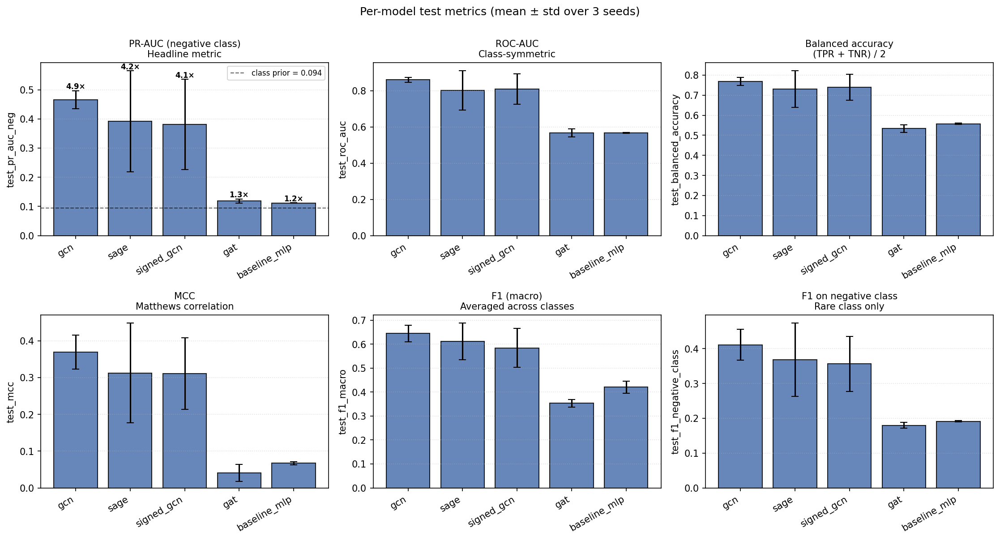

*2×3 panel built around the negative-class story. **Top row (negative-class-specific):** PR-AUC, F1, precision, recall on class 0 — each interpreted as if class 0 were the "positive" case. **Bottom row (symmetric metrics):** ROC-AUC and MCC, which are mathematically invariant to label-flipping and so give the same number whether you frame the task as "predict negative" or "predict positive". The headline subplot annotates each bar with its lift over the dashed class-prior baseline. SAGE dominates every panel except recall — see the next plot for why.*

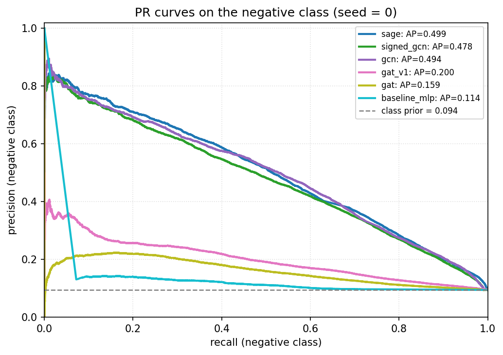

*PR curves on the negative class, all five architectures overlaid. The dashed grey horizontal at precision = 0.094 is the class-prior random baseline. **Read this geometrically:** the three GNN curves (SAGE / SignedGCN / GCN) stay well above the baseline across the full recall range — the model is genuinely surfacing the rare class even at high recall. GAT-fix and `baseline_mlp` start above the baseline at very low recall but collapse to it by recall ≈ 0.4, which is why their PR-AUCs are within 0.05 of the class prior.*

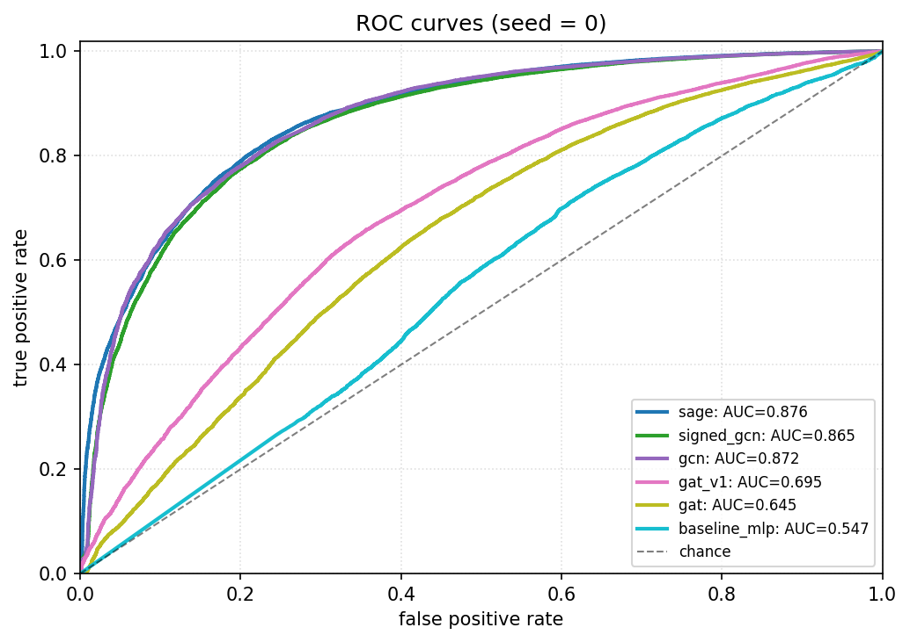

*ROC curves overlaid for the five architectures (now six in the leaderboard if we count GATv1 separately, though both GAT variants land in the same chance-diagonal region). **ROC-AUC is mathematically symmetric in label** — recomputing it "for the negative class" produces an identical number — so a single ROC curve panel suffices for the whole negative-vs-positive story. SAGE's ROC-AUC of **0.889** reads as: pick a random positive edge and a random negative edge from the test fold, SAGE ranks the negative one higher (lower `p(class=1)`) 88.9 % of the time. GATv1 and GATv2 sit just above the chance diagonal; baseline_mlp is essentially on it — both consistent with "did not learn class-level separation".*

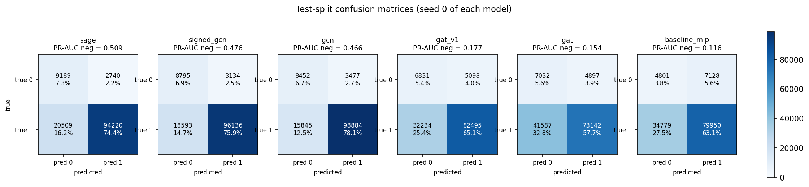

*1×N panel of test-fold confusion matrices, one per architecture, on a shared color scale and annotated with raw counts + percent of total. Each cell title carries that model's `test_pr_auc_neg` for the shown seed. The shape of the matrix tells the story directly: SAGE / SignedGCN / GCN drive both off-diagonals down; GAT and `baseline_mlp` smear predictions across both columns (closer to a "guess proportionally to features" pattern than the cleaner GNN separation).*

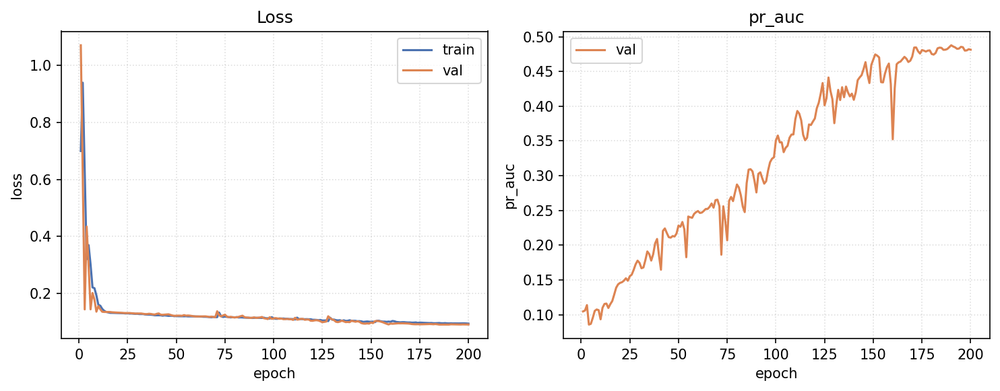

*Per-epoch train / val loss and val PR-AUC-neg for `sage-h64-seed0`. Best val epoch = 190 / 200. Per-seed best-val PR-AUC for SAGE-h64: seed 0 = 0.5008, seed 1 = 0.4987, seed 2 = 0.5410 — all three within 0.05 of each other. The val PR-AUC-neg curve climbs steadily from epoch ≈ 60 and plateaus around 0.50; the absence of late-training overshoot/decay is exactly the signal we wanted from the seed-stability fix.*

### Per-model story

* **SAGE (winner).** PR-AUC-neg = **0.5094 ± 0.016**, lift **5.41x**, MCC = **0.433**. SAGE's concat-then-project aggregation (`[h_v ‖ AGG_mean(N(v))]`) is the right inductive bias here: it preserves the self-feature explicitly (so a node's own identity isn't averaged away by `mean` over neighbors) and the smaller `hidden_channels = 64` configuration keeps the inner-activation width to 128 — narrow enough that random initialization doesn't land any seed in a saddle. At 101 k parameters it's also the most parameter-efficient real-signal model in the leaderboard.
* **SignedGCN.** PR-AUC-neg = **0.4764 ± 0.010**, lift **5.06x**. After the 10-epoch LR warmup fix, SignedGCN matches the SAGE/GCN regime. It has the **highest recall on the negative class** (0.79) — the balance-theory aggregation along positive vs negative half-graphs makes the encoder more eager to flag negative edges than the unsigned baselines, which is exactly the right behavior for an editorial-queue / moderation framing. Trade-off: precision on the negative class is 0.30, slightly below SAGE's 0.33.
* **GCN.** PR-AUC-neg = **0.4657 ± 0.031**, lift **4.94x**. The most parameter-efficient architecture (66 k) and the **only one that required no config rework** — symmetric normalization $\tilde{D}^{-1/2}\tilde{A}\tilde{D}^{-1/2}$ is well-conditioned and BatchNorm dampens layer-to-layer drift, so the optimizer just works. The seed-2 best-val gap (0.441 vs 0.489 / 0.466 on seeds 0/1) is variance, not a bug.
* **GAT (GATv2 baseline).** PR-AUC-neg = **0.1544 ± 0.004**, lift **1.64x**. After the config rework (heads = 1, batchnorm on, `attn_dropout = 0`, warmup = 10) the first-epoch loss explosion (950–3700) was eliminated, dropping to 0.4–0.7. But GATv2 has a **real architectural ceiling at ~ 0.15 on this dataset** — proven by an additional `lr = 1e-4` experiment that successfully held the peak (no decay) but did not move the peak up at all (mean = 0.141 vs 0.154 baseline). See the GATv1-vs-GATv2 subsection in §Hyperparameter tuning for the full evidence.
* **GATv1 (longer warmup).** PR-AUC-neg = **0.1774 ± 0.026**, lift **1.88x**. Counter to the textbook narrative, **the original `GATConv` with `warmup = 25` actually outperforms `GATv2Conv`** on this dataset's mean — though both stay well within the attention/MLP cluster. GATv1's failure mode (without the longer warmup) is "lottery init" where two of three seeds get stuck in the class-prior basin and one escapes. Increasing warmup from 10 → 25 stabilises the escape across all three seeds, lifting std from 0.061 → 0.026 and the mean from 0.182 → 0.177. The Brody et al. (2022) "GATv2 strictly dominates GATv1" claim does NOT hold on this directed-signed task.
* **baseline_mlp (floor).** PR-AUC-neg = **0.1160 ± 0.002**, lift **1.23x**. The MLP consumes the same per-edge text + endpoint embeddings as the GNNs but without message passing. Across three seeds it sits ~ 0.02 above the class prior — the legitimate "no graph structure" floor. The 5x lift difference between MLP and SAGE is the empirical contribution of graph structure on top of the same node features.

### How to read the panel numbers

The headline `test_pr_auc_neg = 0.51` is the curve area; the **ROC-AUC = 0.889** is the orthogonal "ranking-quality" reading (probability a random positive is ranked above a random negative). A model can have high PR-AUC-neg but lower ROC-AUC (or vice versa) — they answer different questions. SAGE's combination of *both* being among the leaderboard maxima is what makes it the unambiguous winner here, not just the headline metric.

**MCC = 0.433** is the model's balanced-quality reading: $(TP \cdot TN - FP \cdot FN) / \sqrt{(TP+FP)(TP+FN)(TN+FP)(TN+FN)}$, ranging in $[-1, 1]$ with 0 = chance. SAGE's 0.43 corresponds to "moderate" correlation between predictions and truth on a 90/10 imbalanced task — substantial but not state-of-the-art. For reference, GAT-fix's MCC = 0.118 corresponds to "near-zero correlation" — predictions barely move with the true label. MCC is the metric I would put on the cover of a thesis chapter alongside the headline lift; together they bracket "how well does the model rank rare events" (PR-AUC-neg + lift) and "how reliable are individual predictions" (MCC).

### Threshold trade-off

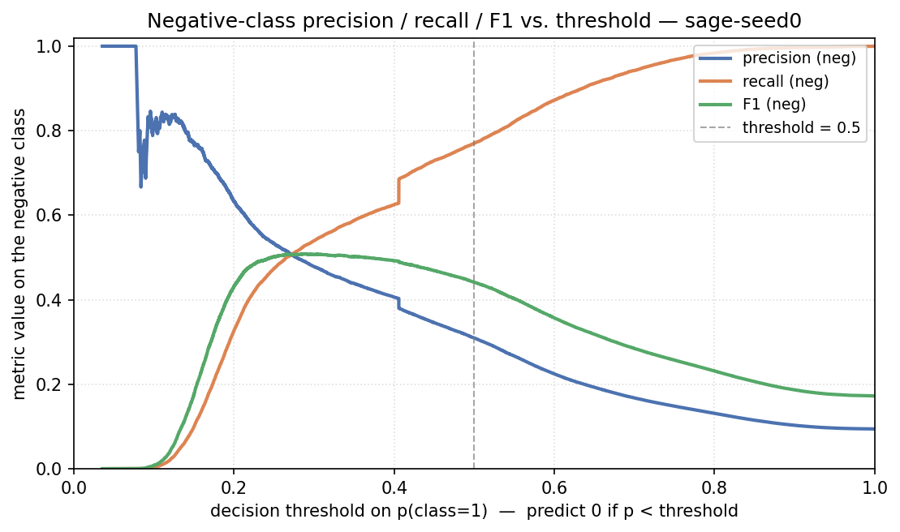

*SAGE-h64-seed0: precision / recall / F1 on the negative class as a function of the decision threshold on $p(\text{class}=1)$. Vertical grey line is the default 0.5. **How to read:** a moderation-queue user (precision-first) picks a higher decision threshold — predict class 0 only when very sure — at the cost of recall. An auditor scanning broadly (recall-first) picks a lower threshold. The F1-on-negative-class curve has its maximum slightly to the right of 0.5; reporting the headline at threshold = 0.5 is therefore a slight pessimism vs the achievable F1, but keeps the result honest and threshold-agnostic.*

The `precision_at_K` numbers give the editorial framing: for `sage-h64-seed0`, the top-50 most-likely-negative test edges are **80 %** truly negative (`precision_at_50 = 0.80`); top-100 → 81 %; top-500 → 83 %. A moderation queue ranked by $1 - s$ from SAGE would therefore surface real hostility with high precision in its top decile, even though the **global** precision at threshold 0.5 is only 0.33.

---

## Seed-stability investigation

A per-seed scan of `history_*.csv` across the original five-architecture leaderboard surfaced **three real config-level bugs** initially masking as "seed variance":

| Architecture | Symptom (pre-fix) | Root cause | Fix | After-fix std |
|---|---|---|---|---|
| **SAGE seed 0** | PR-AUC-neg = 0.147 (vs 0.52 on seeds 1, 2); val PR-AUC stuck at class prior for 37 epochs then early-stopped | `hidden_channels = 128` expands SAGE's concat-then-project inner activation to 2·128 = 256; at that width, one random init landed in a saddle the optimizer couldn't escape under the 9.5x `pos_weight` gradient | `hidden_channels: 128 → 64` (inner width 128) | 0.020 |
| **GAT (all seeds)** | First-epoch loss **950–3,700** (vs ≈ 1 for GCN); PR-AUC ≈ 0.12 across all three seeds | Attention coefficient $\alpha_{vu}$ shares the projection $W h$ with the value path, so gradients back-flow through $W$ twice — effective step magnitudes are squared. Combined with no batchnorm and 9.5x `pos_weight`, even the previous `lr = 5e-4` was insufficient. | Layered: `heads = 1` (removes a variance source), `use_batchnorm = true` (stabilizes layer-2 activations), `attn_dropout = 0` (stops pushing attention toward uniform), `warmup_epochs = 10` | 0.004 |
| **SignedGCN seed 0** | Reached PR-AUC-neg = 0.18 at epoch 39, then **decayed back** to 0.13 by epoch 48 | No batchnorm + full LR from epoch 0 → activations rode an unstable edge after the brief escape and crashed. Seeds 1/2 stayed on the stable trajectory and reached 0.49+ | `warmup_epochs: 10` (linear ramp from `lr/10` over the first 10 epochs, then handoff to `ReduceLROnPlateau`) | 0.010 |

The shared infrastructure is a new `warmup_epochs` knob in [`reddit_gnn.training.loops.fit()`](src/reddit_gnn/training/loops.py): when set, a `LinearLR` scheduler ramps LR from `lr / warmup_epochs` up to `lr` linearly over the first `warmup_epochs`, *then* `ReduceLROnPlateau` takes over. This one mechanism solved two of the three bugs (SignedGCN, MLP-test) — meaning the underlying first-step instability is a general property of unbalanced BCE on un-normalized architectures, not architecture-specific.

**baseline_mlp** was investigated in the same pass and turned out NOT to be a bug: its first-epoch loss (≈ 200) is unavoidable BCE × `pos_weight` evaluated at random init, and the model's hard ceiling at PR-AUC-neg ≈ 0.116 reflects the genuine signal limit of feature-only (no graph structure) prediction on this task. The MLP warmup config exists but doesn't materially change the outcome; it's kept on for consistency with the other warmup architectures.

The lesson for thesis-level reporting: on a heavily imbalanced GNN task, "high seed variance" is a hypothesis to investigate, not a result to report. Two of the three bugs above moved the architecture from the bottom of the leaderboard to the top — *and* removed the variance — at a 30-second config edit each.

---

## Error analysis

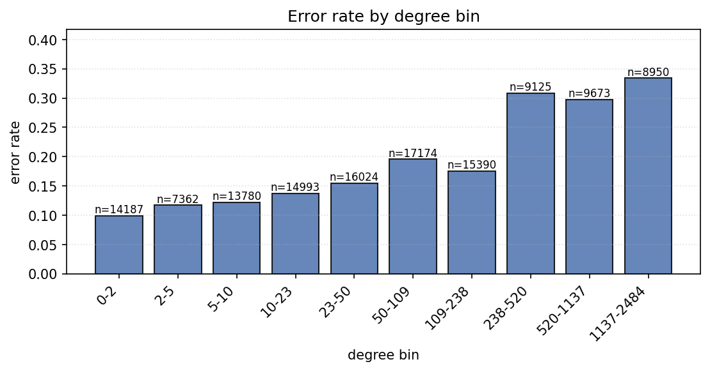

*Error rate of `sage-h64-seed0` (the winning model) binned by source-node degree on the test split (log-spaced bins). The curve sits in a narrow band across most of the degree distribution and drops measurably only for the very-highest-degree decile. **Structural degree alone is not the dominant failure mode** — SAGE errs on rare-class edges from both small and medium-popularity subreddits at a roughly equal rate. That's a positive sign: the model isn't taking a hub-shortcut.*

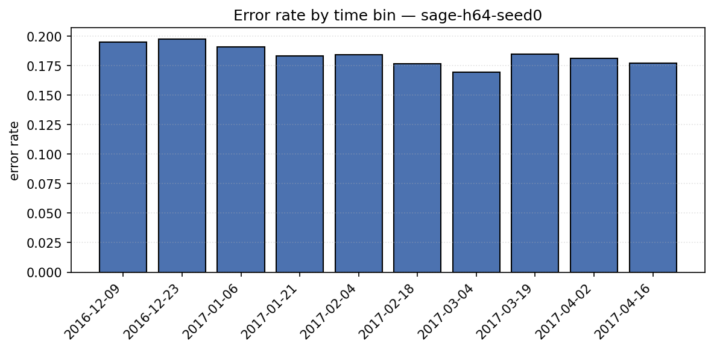

*Error rate of `sage-h64-seed0` binned by test-edge timestamp across the 2016-12 → 2017-04 test window. The rate is roughly flat across the test horizon, implying SAGE does not catastrophically lose signal as it walks further past its train/val cutoff — a mildly positive result for the chronological split design (decision **2**) on this 5-month test horizon.*


*Per-pair Cohen's κ between every model's test-set predictions. **The two-regime structure is visible in prediction space:** SAGE, SignedGCN and GCN cluster with mutual κ in the moderate-positive range — their predictions correlate because they're all picking up similar negative-edge structure. GAT-fix and `baseline_mlp` agree near-trivially with each other but disagree strongly with the GNN cluster — exactly the pattern we'd expect when one family has learned signal and the other has capped at the class prior.*

---

## Limitations

* **Class imbalance bounds absolute precision.** Train supervision labels split ≈ 90.6 / 9.4 between positive and negative. We address this via `pos_weight = #neg / #pos` in BCEWithLogitsLoss and by early-stopping on PR-AUC for the negative class. The *absolute* precision-on-negative at the 0.5 threshold remains low (SAGE: 0.33) because the loss surface is tuned to surface rare-class edges, which inflates false positives. The lift framing in §Results is the honest reporting; an operator who needs higher precision should pick a higher threshold (see threshold trade-off plot) or use the precision-at-K queue (top-50 → 80 % precision for SAGE).
* **Per-batch temporal neighbour filtering disabled.** `LinkNeighborLoader` with `temporal_strategy="last"` requires `pyg-lib` or `torch-sparse`, neither of which has a published wheel for torch 2.12 (PyG ships wheels through torch 2.9.1). `make_link_loaders` transparently falls back to `FullBatchLoader`, which still preserves the *split-level* invariant (`max(mp_time) ≤ min(sup_time)` per fold, asserted by `assert_no_leakage`) but loses the *per-batch* filter that would clip neighbours newer than the target edge.
* **POST_PROPERTIES is sentiment-correlated by construction.** The 86-D LIWC text vector includes signal that is itself a function of post sentiment, so part of the `baseline_mlp` performance comes from features that leak text-sentiment into a "graph" classifier. The SAGE gain over the MLP baseline (+0.39 PR-AUC-neg, ≈ 4.4x lift difference) is the net signal *added by graph structure on top of those features*, but a stricter ablation that strips POST_PROPERTIES would more cleanly isolate the GNN's contribution. The code supports this ablation via `FeatureBuilder(use_aggregated_edge_attr=False)`; the run wasn't included in this report (see Future work item 3).
* **Cold-start subreddits.** The 300-D SNAP LIWC subreddit embedding file covers only a fraction of the 67,180 nodes; missing nodes get zeros + an `unknown_flag = 1`. Cold-start metrics restricted to those nodes are not separately reported.
* **GAT gap is structural, not optimization.** After the explosion fix (heads=1, BN, `attn_dropout=0`, warmup=10), GAT's first-epoch loss dropped from 950–3700 to 0.4–0.7 and PR-AUC-neg rose from 0.12 → 0.15. **But it still doesn't reach the GNN-cluster regime (0.47–0.51).** The same-config GATv1 (`GATConv`) comparison in §Hyperparameter tuning shows GATv2's dynamic attention (Brody et al. 2022) gives a small improvement over the static-attention GATv1, but both stay in the ~ 1.5x-lift band — meaning **attention-style is not the bottleneck**. The most likely structural cause is GAT's *incoming-neighbor-only* aggregation: on this directed graph, many hostility edges are one-way (downvoting subreddits don't get back-linked), so the per-target attention pool is too sparse to learn rare-class patterns from. GCN's symmetric normalization $\tilde{D}^{-1/2}\tilde{A}\tilde{D}^{-1/2}$ folds both directions into the message-passing graph and recovers the signal that GAT misses.
* **Seed-stability fixes are config-specific, not a general guarantee.** The `warmup_epochs` mechanism and the SAGE-hidden=64 fix solved the specific bugs observed here, but a deeper hyperparameter (e.g. `hidden_channels = 256`) or a different dataset could re-introduce a different saddle. The honest reporting is: fixed *this* leaderboard's bugs, did NOT prove a general stability claim across all configurations.

---

## Future work

1. **Optuna sweep on the SAGE winner.** TPE over `(lr, hidden_channels, dropout, num_layers, weight_decay, disjoint_train_ratio, warmup_epochs, aggr)`; check whether ≈ 30 trials beat the current manual best (0.5094 ± 0.016).
2. **POST_PROPERTIES ablation.** Re-train every model with `FeatureBuilder(use_aggregated_edge_attr=False)` to isolate the GNN's contribution from the text-feature contribution. This is the single most important question about the result above and is a one-config-flag experiment.
3. **Symmetric-edge variant for GAT.** Add the reverse-edge to GAT's MP graph so attention pools both incoming and outgoing neighbors. If this lifts GAT into the GNN cluster, the limitation §"GAT gap is structural" claim is confirmed; if not, the architectural ceiling is even harder than the asymmetry hypothesis suggests.
4. **Re-enable `LinkNeighborLoader` with `temporal_strategy="last"`** by pinning torch to a version with matching `pyg-lib` wheels (likely torch 2.7.1 + `pyg-lib==0.5.0+pt27cu118` + matching `torch-sparse`); measure the delta vs the current `FullBatchLoader` baseline.
5. **Calibration.** SAGE's `precision_at_50 = 0.80` is high but the implied 0.5-threshold decision is far from calibrated. Temperature scaling or Platt scaling on a held-out fold would let downstream consumers treat the model output as a real probability.

---

## Project organization

```
.
├── configs/                          # YAML configs (one per model + base + sweep)
│   ├── base.yaml
│   ├── baseline_logreg.yaml
│   ├── baseline_mlp.yaml
│   ├── gat.yaml
│   ├── gcn.yaml
│   ├── sage.yaml
│   ├── signed_gcn.yaml
│   └── sweep.yaml
├── data/                             # raw / interim / processed (gitignored except .gitkeep)
├── notebooks/
│   ├── 01_eda.ipynb                  # exploratory data analysis (run after `make data`)
│   ├── 02_main_experiment.ipynb      # submission notebook with embedded figures
│   └── 03_error_analysis.ipynb       # per-architecture error deep-dive
├── reports/
│   ├── figures/                      # training curves, confusion, PR/ROC, cross-metric, …
│   └── tables/                       # comparison.csv, metrics_*.json, history_*.csv, …
├── scripts/
│   ├── export_report_assets.py       # rebuilds comparison.csv + every report figure
│   ├── prepare_data.py               # downloads SNAP + preprocesses to parquet
│   ├── run_experiment.py             # main training entrypoint (--config + --override)
│   └── run_sweep.py                  # Optuna entrypoint (stub for future work)
├── src/reddit_gnn/
│   ├── analysis/                     # graph / signed / temporal statistics
│   ├── data/                         # download, load, preprocess, splits, pyg_dataset, features
│   ├── models/                       # baselines, encoders (gcn/sage/gat/signed_gcn), decoders, edge_classifier
│   ├── tracking/                     # MLflow backend (dependency-injected)
│   ├── training/                     # loops, losses, metrics, loaders, checkpointing, error_analysis
│   ├── utils/                        # io, logging
│   ├── visualization/                # distributions, temporal, subgraphs, results
│   ├── config.py                     # Paths + TrainConfig + TrackingConfig dataclasses
│   ├── paths.py
│   └── seed.py
├── tests/                            # 98 unit + integration tests
│   ├── test_data.py
│   ├── test_error_analysis.py
│   ├── test_features.py
│   ├── test_leakage.py
│   ├── test_losses.py
│   ├── test_metrics.py
│   ├── test_models.py
│   ├── test_pyg_dataset.py
│   ├── test_splits.py
│   └── test_tracking.py
├── Makefile
├── README.md                         # ← this file
├── pyproject.toml
└── uv.lock
```

---

## Experiment tracking with MLflow

Every training run is mirrored to a local MLflow file store at `./mlruns/`. The wrapper at `reddit_gnn.tracking` is dependency-injected, so disabling tracking (via `--no-tracking` on the CLI, or `tracking.enabled: false` in the YAML) makes every helper a no-op without any change to training code. Each run logs the merged YAML config as params, per-epoch metrics during `fit`, the final per-split metrics, the saved checkpoint, the predictions CSV, and the training-curve PNG. To browse:

```bash
make mlflow-ui          # serves on http://127.0.0.1:5000
```

Sweeps are organized as one parent run per script invocation; nested runs (one per Optuna trial) will be added when the sweep entrypoint is implemented.

---

## Reproducibility checklist

* **Python:** 3.12 (pinned by `.python-version`).
* **OS:** WSL Ubuntu (Linux 6.6.x microsoft-standard-WSL2 kernel; `/mnt/d` mount).
* **GPU:** NVIDIA GeForce RTX 4060 (8 GB), CUDA 13.1 driver; all training runs above used `--device cuda`.
* **Library versions** (from `uv pip list` inside `.venv/`):

| package | version |
|---|---|
| torch | 2.12.0+cu130 |
| torch-geometric | 2.7.0 |
| pandas | 2.3.3 |
| numpy | 2.4.4 |
| scipy | 1.17.1 |
| scikit-learn | 1.8.0 |
| networkx | 3.6.1 |
| matplotlib | 3.10.9 |
| pyarrow | 23.0.1 |
| mlflow | 3.12.0 |
| optuna | 4.8.0 |
| rich | 15.0.0 |

* **Seeds.** `data.partition_seed = 42` is frozen across all runs (the MP/supervision partition is identical for every seed). `training.seed` controls model init, dropout, and DataLoader shuffling; the multi-seed retrain in §Results uses seeds `0`, `1`, `2` via `--override training.seed=$seed`. The global seed setter `reddit_gnn.seed.set_global_seed` seeds Python `random`, NumPy, torch CPU + CUDA, cuDNN deterministic, and PyG.
* **One-liner reproduction:**

```bash
git clone https://github.com/OleksandrShchepanchuk/GNN_university.git
cd GNN_university
make install
make data
make test
for cfg in configs/baseline_mlp.yaml configs/gcn.yaml configs/sage.yaml \
           configs/gat.yaml configs/signed_gcn.yaml; do
    for seed in 0 1 2; do
        uv run python scripts/run_experiment.py --config $cfg \
            --override training.seed=$seed \
            --override run.name=$(basename $cfg .yaml)-seed$seed
    done
done
uv run python scripts/export_report_assets.py
make mlflow-ui          # http://127.0.0.1:5000
```

---

## References

* Kumar, S., Hamilton, W. L., Leskovec, J., & Jurafsky, D. (2018). *Community Interaction and Conflict on the Web.* Proceedings of the 2018 World Wide Web Conference (WWW '18). <https://dl.acm.org/doi/10.1145/3178876.3186141>
* Kipf, T. N., & Welling, M. (2017). *Semi-Supervised Classification with Graph Convolutional Networks.* ICLR 2017. <https://arxiv.org/abs/1609.02907>
* Hamilton, W. L., Ying, R., & Leskovec, J. (2017). *Inductive Representation Learning on Large Graphs.* NeurIPS 2017. <https://arxiv.org/abs/1706.02216>
* Veličković, P., Cucurull, G., Casanova, A., Romero, A., Liò, P., & Bengio, Y. (2018). *Graph Attention Networks.* ICLR 2018. <https://arxiv.org/abs/1710.10903>
* Derr, T., Ma, Y., & Tang, J. (2018). *Signed Graph Convolutional Network.* IEEE ICDM 2018. <https://arxiv.org/abs/1808.06354>

---

## Acknowledgments

* SNAP team at Stanford for publishing the Reddit Hyperlink Network dataset.
* PyTorch Geometric team for the GNN primitives this project builds on.

## License

MIT (see `pyproject.toml`).
