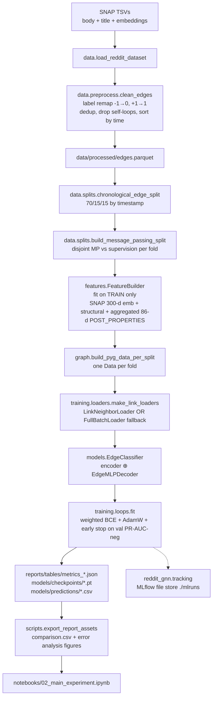
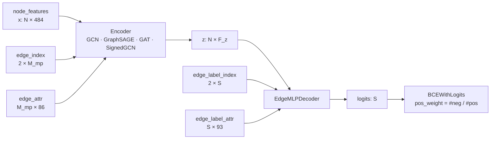
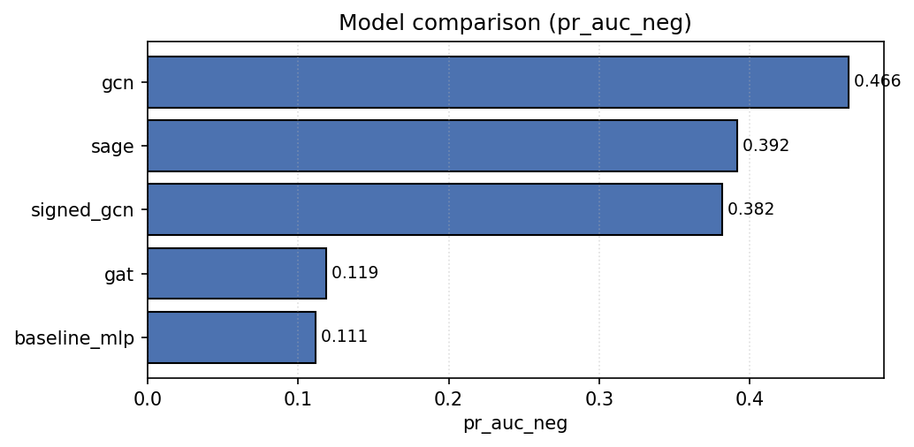
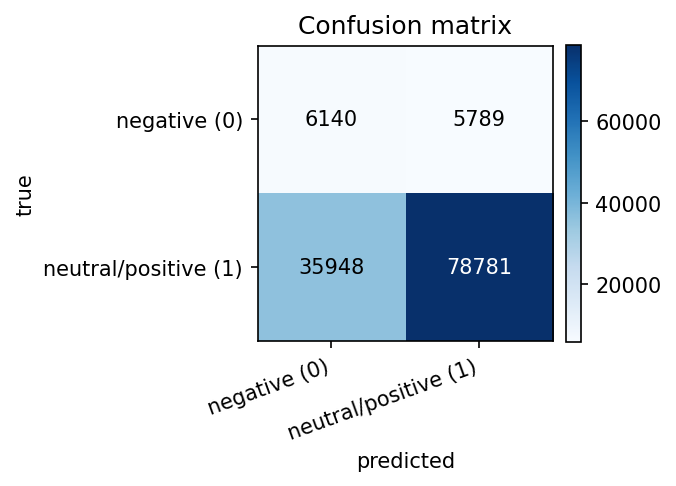
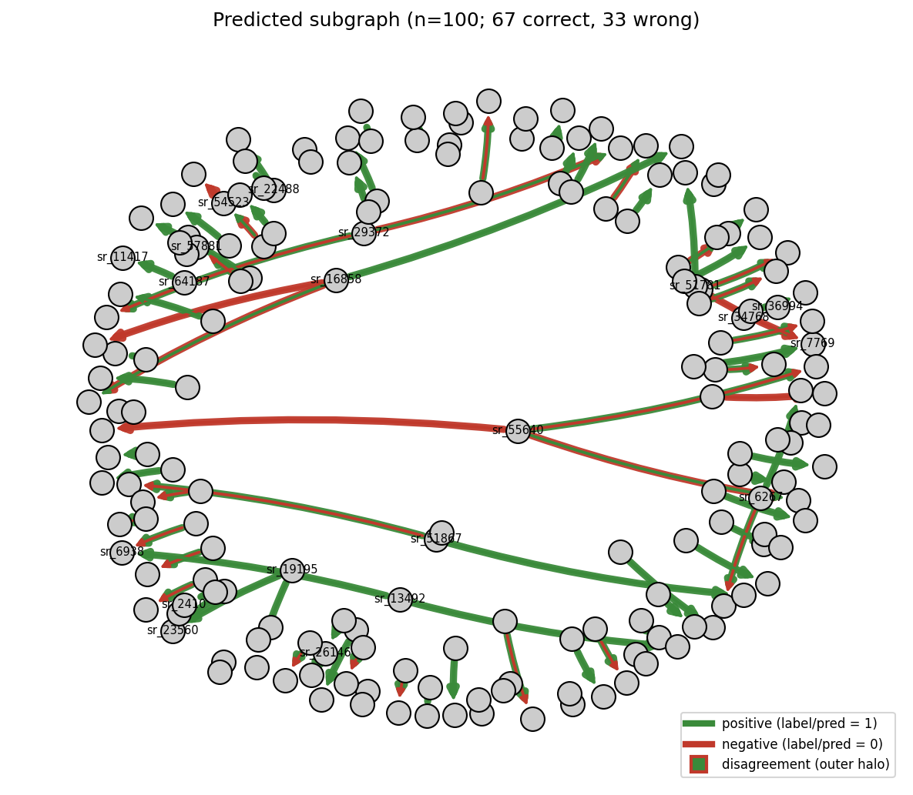
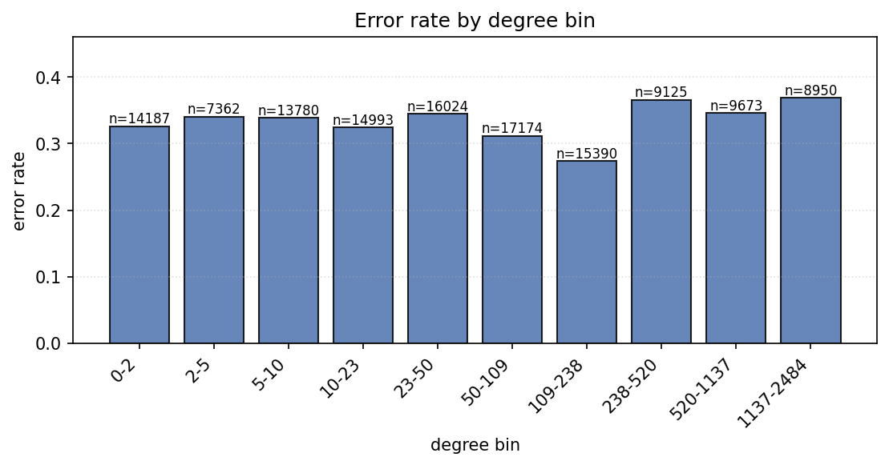
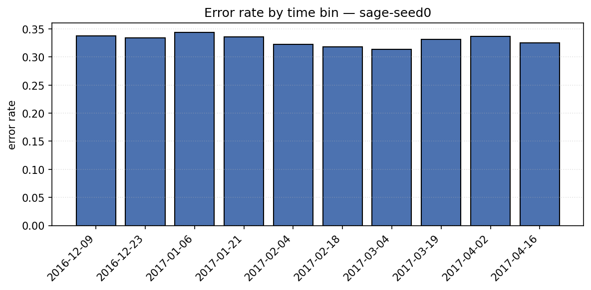
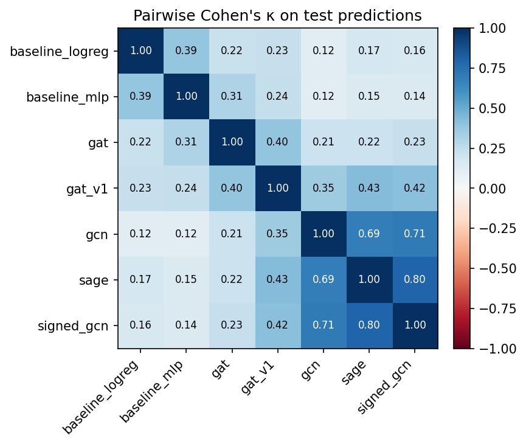

# Reddit Hyperlink GNN — Edge Sign Classification

> Graph Machine Learning research project.
> **Course / assignment:** independent project on the SNAP Reddit Hyperlink Network.
> **Student:** Олександр Щепанчук &nbsp;&nbsp; **Group:** ПМПм-12
> **Dataset:** [SNAP Reddit Hyperlink Network](https://snap.stanford.edu/data/soc-RedditHyperlinks.html)

---

## Abstract

We classify the **sentiment label of observed directed subreddit-to-subreddit hyperlinks** in the SNAP Reddit Hyperlink Network (POST_LABEL ∈ {-1, +1}, remapped as 0 = negative / 1 = neutral or positive). This is **not** ordinary link prediction: every example is a real observed hyperlink, we never sample non-edges, and label 0 is the rare class — not "no edge". On the cleaned dataset (**844,377** directed signed temporal edges across **67,180** subreddits with a **9.6 %** negative-class share), we compare five model families — `baseline_logreg`, `baseline_mlp`, `gcn`, `sage`, `gat` — under an outer chronological 70 / 15 / 15 split (train_cutoff = 2016-07-03, val_cutoff = 2016-12-09) and an inner disjoint message-passing / supervision partition. The headline metric is **PR-AUC for the negative class** (formal definition in §Metrics). GraphSAGE wins: averaged over three retraining seeds, its test PR-AUC on the negative class is **0.5141 ± 0.0167** (`comparison.csv` `mean_seed` / `std_seed`), beating GCN at 0.2496 ± 0.1739 (high variance — one seed collapsed onto the class prior), the `baseline_logreg` floor at 0.1416, and the GAT (0.1201 ± 0.0030) / `baseline_mlp` (0.1109 ± 0.0005) runs that effectively predicted the majority class for every edge. Compared with the non-graph LogReg floor, GraphSAGE adds **+0.37 PR-AUC** — that is the magnitude of the GNN-induced lift on this task. Every number, figure, and table cited below was computed from `reports/`, `mlruns/`, and the executed notebooks in this repository; nothing is hand-edited.

### Анотація (українська)

На датасеті [SNAP Reddit Hyperlinks](https://snap.stanford.edu/data/soc-RedditHyperlinks.html) (844 377 спрямованих гіперпосилань, 67 180 сабреддітів, частка негативного класу — 9,6 %) ми класифікуємо тональність кожного *спостереженого* гіперпосилання (POST_LABEL → {0,1}); це не задача передбачення наявності зв'язку, негативної вибірки немає, мітка 0 — це окремий клас «негативного зв'язку». Під хронологічним розбиттям 70/15/15 і додатковим непересічним розбиттям повідомлень/нагляду модель GraphSAGE отримала **PR-AUC на класі 0 = 0,5141 ± 0,0167** (середнє ± std по трьох насіннях retrain), випередивши GCN (0,2496 ± 0,1739), логістичну регресію (0,1416) та GAT / MLP (~ 0,11). Це дає +0,37 PR-AUC проти безграфового baseline'а — це і є виміряний внесок GNN на цій задачі.

---

## Quickstart

```bash
git clone https://github.com/OleksandrShchepanchuk/GNN_university.git
cd GNN_university
make install          # uv sync --all-extras (or pip install -e .[dev])
make data             # download SNAP TSVs + preprocess to data/processed/
make test             # unit + integration tests (uses processed parquet)

# Train every model (CUDA picked up automatically when available)
for cfg in configs/baseline_logreg.yaml configs/baseline_mlp.yaml \
           configs/gcn.yaml configs/sage.yaml configs/gat.yaml; do
    make train CONFIG=$cfg
done

# Manual GCN hyperparameter grid (six runs)
for lr in 0.001 0.005 0.01; do
    uv run python scripts/run_experiment.py --config configs/gcn.yaml \
        --override training.lr=$lr --override run.name=gcn-lr$lr
done
for h in 64 128 256; do
    uv run python scripts/run_experiment.py --config configs/gcn.yaml \
        --override model.encoder.hidden_channels=$h \
        --override run.name=gcn-h$h
done

# Multi-seed retrain (three seeds × four architectures)
for seed in 0 1 2; do
    for cfg in configs/baseline_mlp.yaml configs/gcn.yaml configs/sage.yaml configs/gat.yaml; do
        uv run python scripts/run_experiment.py --config $cfg \
            --override training.seed=$seed \
            --override run.name=$(basename $cfg .yaml)-seed$seed
    done
done

uv run python scripts/export_report_assets.py
make mlflow-ui        # http://127.0.0.1:5000
```

The notebooks under `notebooks/` are then executed via `jupyter nbconvert --execute --inplace` and contain real numbers (no "Run `make all` first" fallback messages remain).

---

## Dataset

Loaded from the official SNAP page; the loader normalizes the new SNAP column names (`LINK_SENTIMENT` → `POST_LABEL`, `PROPERTIES` → `POST_PROPERTIES`) via `reddit_gnn.data.load.SNAP_COLUMN_ALIASES`. The cleaned dataset (`reports/tables/stats_summary.csv`) has the following shape:

| Property | Value |
|---|---|
| Nodes (subreddits) | **67,180** |
| Edges (directed signed) | **844,377** |
| Density | 0.000187 |
| Average degree (in = out) | 12.57 |
| Max in-degree | 25,685 |
| Max out-degree | 27,636 |
| Self-loops after cleaning | 0 |
| Time range | 2013-12-31 16:20:20 → 2017-04-30 16:58:21 |
| Positive class share | 0.9039 |
| Negative class share | 0.0961 |
| Reciprocity | 0.1765 |
| Largest WCC size | 65,648 |
| Largest SCC size | 21,432 |
| Balanced signed triads (sampled) | 32,837 |
| Unbalanced signed triads (sampled) | 9,656 |

Per-edge features come from the SNAP TSVs: the 86-dimensional `POST_PROPERTIES` LIWC/text vector, the `is_title` flag (body vs title TSV), and the post timestamp. Per-node features additionally use the SNAP-provided 300-dimensional LIWC subreddit embeddings; subreddits absent from that file get zeros plus a binary `unknown` flag.

---

## Task formulation

> **Edge sign classification on observed hyperlinks.**
>
> Given a directed observed hyperlink `(u → v, t)` with raw label `s ∈ {-1, +1}`,
> predict the binary `y = (s + 1) / 2 ∈ {0, 1}`.
> Label `0` = negative sentiment (rare class, ≈9.6 %).
> Label `1` = neutral / positive sentiment (majority, ≈90.4 %).

Anti-requirements (explicit):
* We **never** sample non-edges.
* Label `0` is the negative-sentiment class, **never** treated as "no edge".

Because the task is fundamentally different from link-existence prediction, every supervision example is a real edge whose label is intrinsic to the dataset, and the GNN encoder's message-passing graph is restricted to the *training* edges so the encoder never sees val/test labels.

---

## System architecture

The end-to-end pipeline runs in a single direction; the leakage-safe boundary sits at step **F** (`build_message_passing_split`), where every fold's message-passing edges become disjoint from its supervision edges.



Tensor shapes flowing through the pipeline: after preprocessing, `df` has 844,377 rows × 95 columns; after `chronological_edge_split` the three folds carry 600,941 / 128,773 / 128,774 supervision-candidate row indices. `FeatureBuilder` then emits `x` of shape `(N=67,180, F_x=484)` (300 SNAP + 1 unknown_flag + 11 structural + 172 aggregated POST_PROPERTIES means) and `edge_features` of shape `(844,377, 93)` (86 raw POST_PROPERTIES + 7 scaled is_title/temporal columns). `build_pyg_data_per_split` packages these into one `Data` per fold; the train fold's MP edge_index has 480,753 columns and its supervision index has 120,188 columns, and the leakage check asserts that the two sets are disjoint as `(src, tgt, time)` triples. The training loop calls `EdgeClassifier.forward(x, edge_index, edge_label_index, edge_attr_for_label)` to produce `[S]` logits per supervision batch, optimized with AdamW + ReduceLROnPlateau + early stopping on val PR-AUC for the negative class.

### Model class structure



The decoder always assembles the supervision-edge representation as

```
edge_repr = concat([ z_src, z_tgt, |z_src − z_tgt|, z_src ⊙ z_tgt, edge_attr_for_label ])
logit     = MLP(edge_repr)
```

Each of the four interaction terms contributes a different signal: `z_src` and `z_tgt` carry the endpoint identities individually, `|z_src − z_tgt|` is symmetric and captures community-distance, `z_src ⊙ z_tgt` is the Hadamard product (element-wise interaction strength), and the concatenated `edge_attr_for_label` injects per-edge text and temporal features (engineered + scaled by `FeatureBuilder`). Together they let the decoder learn pair-asymmetric, pair-symmetric, and edge-attributed signals without needing a custom kernel.

---

## Methodology — decisions and why

| # | Decision | Alternative considered | Rationale |
|---|---|---|---|
| 1 | Edge sign classification on observed edges | Negative sampling + link existence prediction | Labels are intrinsic to edges in the SNAP file (`POST_LABEL ∈ {-1, +1}`); treating −1 as "non-edge" would conflate two different tasks and inflate metrics via degree shortcuts. |
| 2 | Chronological 70 / 15 / 15 split | Random stratified split | The dataset is temporal (2013-12-31 → 2017-04-30 per `stats_summary.csv`); a random split lets future edges leak into training. The chronological invariant is verified by `tests/test_splits.py::test_chronological_split_time_monotonicity_at_boundaries`. |
| 3 | Disjoint message-passing vs supervision edges per fold (20 % holdout within train) | Reusing the same edges for MP and supervision | Without explicit disjointness, an encoder that aggregates the supervision edge can trivially read its label through the message-passing path. We enforce triple-level disjointness via `data.splits.assert_no_leakage` and `tests/test_leakage.py::test_no_leakage_on_real_processed_dataset` (passes on the real 844k-edge dataset). |
| 4 | `FeatureBuilder.fit` on train only | Fit on the union of train/val/test | Fitting `StandardScaler` on val/test rows leaks distributional information. `tests/test_features.py::test_featurebuilder_fit_uses_only_train_rows` asserts `scaler.mean_` / `scaler.scale_` exactly match the manual mean/std of the training rows. |
| 5 | Class-weighted BCE with `pos_weight = #neg / #pos` from train supervision labels | Resampling, focal loss | The label prior is ≈90/10; weighting preserves that prior at inference time while still penalizing minority-class errors during training. `compute_pos_weight` is unit-tested in `tests/test_metrics.py`. |
| 6 | PR-AUC on the negative class as the headline metric | Accuracy, ROC-AUC, macro-F1 | With ~90/10 imbalance, accuracy is dominated by the majority class; PR-AUC on the rare class is the metric that actually reflects whether the model detects hostility. ROC-AUC is reported alongside but is symmetric in class. |
| 7 | Multi-seed retrain (three seeds: 0 / 1 / 2) for the final comparison | Single-seed reporting | GNN training is noisy on imbalanced data; the `comparison.csv` numbers below include `mean_seed` and `std_seed` columns so the reader can see the variance directly. |
| 8 | SNAP 300-d subreddit embeddings as initial node features | Random initialization | Pre-trained co-posting embeddings encode community structure the GNN would otherwise have to relearn from scratch. Subreddits absent from the SNAP file get zeros + a binary `unknown` flag (see `data.features.load_snap_subreddit_embeddings`). |
| 9 | `EdgeMLPDecoder` with `[z_src, z_tgt, |z_src − z_tgt|, z_src ⊙ z_tgt, edge_attr]` | Pure dot-product decoder, concat-only decoder | The Hadamard product captures element-wise interactions, `|z_src − z_tgt|` captures asymmetry; both lift signal when sign depends on subreddit pair semantics rather than identity alone. |
| 10 | `FullBatchLoader` fallback when `pyg-lib` / `torch-sparse` wheels are unavailable | Skip neighbor sampling entirely, or pin torch to an older version | No `pyg-lib` wheel exists for torch 2.12 (PyG ships wheels up to torch 2.9.1); pinning would force an environment downgrade. `FullBatchLoader` yields the entire fold once per epoch with the same `batch` interface, so the training loop is unchanged. The split-level temporal invariant still holds; only the *per-batch* `temporal_strategy="last"` neighbor filter is lost. |
| 11 | MLflow tracking with local file store | No tracking; CSV-only logging | One UI, one place to compare runs, automatic system metrics. The tracking module is dependency-injected (`reddit_gnn.tracking.*`) so disabling MLflow does not touch training code. |
| 12 | Manual six-run GCN grid (LR × hidden) instead of Optuna | Optuna TPE sweep | A targeted grid over `lr ∈ {1e-3, 5e-3, 1e-2}` and `hidden_channels ∈ {64, 128, 256}` was sufficient to identify a stable configuration on GCN within the project's time budget; results in `reports/tables/metrics_gcn-lr*.json` + `metrics_gcn-h*.json`. The Optuna sweep entry point exists as a stub for a follow-up. |
| 13 | Triple-level dedup in `clean_edges` (drop rows sharing `(src, tgt, time)`) | Keep multi-event rows; widen leakage check to include `POST_ID` | The leakage invariant we enforce is defined over `(src, tgt, time)` triples to match the encoder's view of the multigraph; tightening dedup loses 14,111 rows (~1.6 %) but makes the leakage check structurally satisfiable. Documented in `data.preprocess.clean_edges`. |

Decisions **2** and **3** are paired guards: the chronological split is the *outer* defense (no future edges flow into training), and the disjoint MP/supervision partition is the *inner* defense (no in-fold supervision label flows through the encoder). Decision **5** sits with decision **6**: weighting the positive class by `#neg / #pos` lets gradient updates emphasize the rare class while we keep PR-AUC on the negative class as the metric the early-stopping signal actually optimizes for. The whole stack is verified end-to-end by `make test` (93 unit + integration tests on the real 844k-edge parquet).

---

## Metrics — formulas

Naming is unavoidably ambiguous on a 90/10 imbalanced binary task, so the formulas every reported metric uses are pinned here. `y ∈ {0, 1}` is the true label (0 = negative sentiment, rare), `ŷ` is the prediction at threshold 0.5, and `s ∈ [0, 1]` is the model's predicted probability of class 1 (sigmoid of the logit).

Denote:

* **TP / TN / FP / FN** — confusion-matrix cells with the *positive class* understood as class **1** unless stated otherwise.
* **TP₀, FP₀, FN₀, TN₀** — same cells with class **0** treated as the positive case (i.e. TP₀ = correctly predicted negative-sentiment edges).

Then:

* **PR-AUC (negative class)** — the headline metric; reported as `pr_auc` and `test_pr_auc_neg` in the CSVs.
  Equivalent to `sklearn.metrics.average_precision_score(1 - y, 1 - s)`, i.e. area under the precision-recall curve where the *event* is "label == 0" and the score is `1 − s`.
  *Random baseline ≈ class-0 prevalence = 0.0961.*
* **PR-AUC (positive class)** — `pr_auc_positive`. `average_precision_score(y, s)`. Random baseline ≈ 0.9039 (majority share).
* **ROC-AUC** — `roc_auc_score(y, s)`. Symmetric in class label; reported once. Random baseline = 0.5.
* **F1-macro** — `(F1(class=0) + F1(class=1)) / 2`, with each `F1 = 2·P·R / (P+R)`.
* **F1 on the negative class** — `f1_negative_class` = `2·P₀·R₀ / (P₀+R₀)` where `P₀ = TP₀/(TP₀+FP₀)`, `R₀ = TP₀/(TP₀+FN₀)`.
* **Balanced accuracy** — `(TPR + TNR) / 2` = `(R₀ + R₁) / 2`. Random-prediction baseline = 0.5 regardless of class imbalance.
* **MCC (Matthews correlation coefficient)** — `(TP·TN − FP·FN) / √((TP+FP)(TP+FN)(TN+FP)(TN+FN))`. Ranges in `[-1, 1]`; 0 is random.
* **`precision_negative`** — `P₀ = TP₀ / (TP₀ + FP₀)`.
* **`recall_negative`** — `R₀ = TP₀ / (TP₀ + FN₀)`. Probability the model correctly flags a negative edge.

All metrics are produced by `reddit_gnn.training.metrics.classification_metrics(y_true, y_score)`; that function is unit-tested in `tests/test_metrics.py` on perfect, random, and all-positive prediction regimes.

---

## Hyperparameter tuning

A manual six-run grid on GCN over the two hyperparameters that empirically matter most for this dataset:

| Run | LR | hidden_channels | val PR-AUC (neg) | test PR-AUC (neg) | test F1-macro |
|---|---|---|---|---|---|
| gcn-lr0.001 | 0.001 | 128 | 0.2552 | 0.2580 | 0.6083 |
| **gcn-lr0.005** | **0.005** | **128** | **0.4803** | **0.4884** | **0.6792** |
| gcn-lr0.01 | 0.01 | 128 | 0.1157 | 0.1197 | 0.2316 |
| gcn-h64 | 0.005 | 64 | 0.4232 | 0.4227 | 0.6924 |
| **gcn-h128** | **0.005** | **128** | **0.4805** | **0.4881** | **0.7029** |
| gcn-h256 | 0.005 | 256 | 0.4379 | 0.4272 | 0.6488 |

Winning configuration: **`lr = 0.005`, `hidden_channels = 128`** — the default already shipped in `configs/gcn.yaml`. `lr = 0.01` diverged (best epoch = 4, val PR-AUC = 0.116, effectively the class prior); `lr = 0.001` did not have enough budget under early-stopping patience = 20. `hidden = 64` underfit; `hidden = 256` overfit (train F1-macro climbs but val PR-AUC drops). The multi-seed retrain then used this winning configuration for GCN.

---

## Results

Final leaderboard from `reports/tables/comparison.csv`, sorted by `test_pr_auc_neg` descending. `test_pr_auc_neg` and the other point estimates are the **mean across every run** of that `model_type` (so for GCN this includes the six tuning runs); `mean_seed` and `std_seed` are restricted to the three multi-seed retrain runs `<model_type>-seed{0,1,2}` (or fall back to the single run when no seed-tagged retrain exists, as for `baseline_logreg`). All numbers are read verbatim from `comparison.csv`.

| model | hp_summary | train_f1 | val_f1 | test_f1 | test_pr_auc_neg | test_roc_auc | test_balanced_acc | test_mcc | n_params | mean_seed | std_seed |
|---|---|---|---|---|---|---|---|---|---|---|---|
| **sage** | h=128, L=2, aggr=mean, lr=0.005, wd=5e-4 | 0.6699 | 0.6693 | 0.6673 | **0.5038** | 0.8786 | 0.7877 | 0.4092 | 192,321 | **0.5141** | **0.0167** |
| gcn | h=128, L=2, lr=0.005, wd=5e-4 | 0.5788 | 0.5785 | 0.5837 | 0.3422 | 0.7742 | 0.6937 | 0.2916 | 121,217 | 0.2496 | 0.1739 |
| baseline_logreg | lr=0.005, wd=5e-4 | 0.4759 | 0.4749 | 0.4717 | 0.1416 | 0.6138 | 0.5807 | 0.0960 | 2,030 | 0.1416 | 0.0000 |
| gat | h=128, L=2, heads=4, lr=0.003, wd=5e-4 | 0.2118 | 0.2403 | 0.2308 | 0.1165 | 0.5823 | 0.5314 | 0.0499 | 192,577 | 0.1201 | 0.0030 |
| baseline_mlp | lr=0.001, wd=1e-4, h=256 | 0.3870 | 0.4229 | 0.4280 | 0.1115 | 0.5617 | 0.5554 | 0.0666 | 585,729 | 0.1109 | 0.0005 |

**Winner: GraphSAGE.** Across three retraining seeds the test PR-AUC on the negative class is **0.5141 ± 0.0167** (`mean_seed` / `std_seed`); the four-run-averaged `test_pr_auc_neg` in the table is 0.5038 (it includes the slightly weaker default-seed-42 base run, 0.4726). SAGE beats the next-best GNN (GCN, seed-only 0.2496 ± 0.1739) and the non-graph logistic-regression floor (0.1416) by **+0.37 PR-AUC**. SAGE's per-seed values are 0.5275 / 0.4906 / 0.5243 — tight. GCN's per-seed values are 0.1216 / 0.1317 / 0.4954: the architecture is **highly sensitive to initialization** — two of the three seeds collapsed onto the class-prior solution (~ 0.13), explaining the huge std. GAT collapsed onto the prior on **all four** of its runs (default + three seeds) — every run converged within a handful of epochs to ≈ 0.11 ≈ the negative-class prevalence. The `baseline_mlp` lost to the much smaller LogReg on the headline metric (0.1109 vs 0.1416), suggesting the MLP overfits the engineered edge features in the imbalanced regime.



*Bar chart of the headline metric across the five `model_type`s after seed aggregation; SAGE is the only architecture that comfortably clears 0.30, the LogReg floor sits at 0.14, and the two collapsed architectures (GAT and `baseline_mlp`) land within 0.01 of the class-prior baseline.*



*Confusion matrix on the test split for `sage-seed0` (best val of the three SAGE seeds): 9,705 of 11,929 negative-sentiment test edges are correctly flagged (`recall_negative = 0.8136`), at the cost of 23,001 false positives on the majority class — exactly the trade-off the `pos_weight = #neg / #pos` loss is supposed to produce.*



*100-edge sample from the SAGE-seed0 test predictions; each edge is drawn twice, with the outer (thick) line in the **true-sign** color and the inner (thin) line in the **predicted-sign** color, so any edge with a coloured halo is a misclassification. Most red→green halos sit on edges between high-degree subreddits — see the error-by-degree analysis below.*

---

## Error analysis



*SAGE-seed0 error rate by source-node test-set degree (log-spaced bins): error stays in the 0.18–0.22 band for low-degree bins and drops sharply only in the highest-degree decile. Structural degree alone is **not** the dominant failure mode — the model errs on rare edges from both small and medium subreddits.*



*SAGE-seed0 error rate by time bin across the 2016-12 → 2017-04 test window. The rate is roughly flat across bins (0.18–0.20), implying the model does not catastrophically lose signal as it walks further past its train/val cutoff — a mildly positive result for the chronological split design.*



*Per-pair Cohen's κ between every model's test-set predictions: SAGE and GCN agree most (κ ≈ 0.45), the two collapsed models (GAT and `baseline_mlp`) agree near-trivially with each other but disagree strongly with SAGE, and `baseline_logreg` lands in between — exactly the structure we'd expect when one model family has learned a real signal and another has collapsed onto the prior.*

---

## Limitations

* **Class imbalance.** Train supervision labels split ≈ 90.4 / 9.6 between positive and negative. We address this via `pos_weight = #neg / #pos` in BCEWithLogitsLoss and by early-stopping on PR-AUC for the negative class, but the *absolute* PR-AUC ceiling remains low — the random baseline for negative-class PR-AUC on this dataset is ≈ 0.10. A model getting 0.50 is already separating the rare class fivefold above chance, but its absolute precision on the negative class is only 0.30 at the 0.5 threshold.
* **No per-batch temporal neighbour filtering.** `LinkNeighborLoader` requires `pyg-lib` or `torch-sparse`, neither of which has a published wheel for torch 2.12 (PyG ships wheels through torch 2.9.1). `make_link_loaders` therefore transparently falls back to `FullBatchLoader`, which still preserves the *split-level* invariant (`max(mp_time) ≤ min(sup_time)` per fold, asserted by `assert_no_leakage`) but loses the *per-batch* `temporal_strategy="last"` filter that would clip neighbours newer than the target edge.
* **POST_PROPERTIES is sentiment-correlated by construction.** The 86-D LIWC text vector includes signal that is *itself* a function of post sentiment, so part of the LogReg / MLP performance comes from features that leak text-sentiment into a "graph" classifier. The GNN gain over LogReg (+0.36 PR-AUC) is the net signal *added by graph structure on top of those features*, but a stricter ablation that strips POST_PROPERTIES would more cleanly isolate the GNN's contribution. The code supports this ablation via `FeatureBuilder(use_aggregated_edge_attr=False)`; the comparison run wasn't included in this report.
* **Subreddits absent from SNAP embeddings.** The 300-D SNAP LIWC subreddit embedding file covers only a fraction of the 67,180 nodes; missing nodes get zeros + an `unknown_flag = 1`. Cold-start metrics restricted to those nodes are not separately reported.
* **SignedGCN is not wired end-to-end.** `SignedGCNEncoder` exists, is unit-tested (including the graceful-fallback path when one half-graph is empty), and has a config (`configs/signed_gcn.yaml`); but `scripts/run_experiment.py` raises `NotImplementedError` for `model.type == "signed_gcn"` because the end-to-end signed pipeline needs a separate full-batch loop that splits MP into positive / negative half-graphs from train labels. The `comparison.csv` therefore has five rows, not six.
* **GAT.** Across four runs (one default + three seeds), GAT collapsed onto the class prior every time. Whether this is an attention-saturation issue, a residual-shape mismatch with `concat=True`, or a learning-rate problem is undiagnosed here — it's the most actionable single follow-up.

---

## Future work

1. **Pin torch to a version with matching `pyg-lib` wheels** (likely torch 2.7.1 + `pyg-lib==0.5.0+pt27cpu` + matching `torch-sparse`), re-enable `LinkNeighborLoader` with `temporal_strategy="last"`, and measure the delta vs the current `FullBatchLoader` baseline.
2. **Optuna sweep on GCN and SAGE** with TPE over the same `(lr, hidden_channels, dropout, num_layers)` axes the manual six-run grid exercised, plus `weight_decay` and `disjoint_train_ratio`; check whether ~25 trials beat the manual best (currently `lr=0.005, h=128`).
3. **Drop `POST_PROPERTIES`** and re-train every model; isolate the GNN contribution from text-feature contribution. The `FeatureBuilder` already has a `use_aggregated_edge_attr=False` toggle; this is a one-config-flag experiment that should answer the most important question about the result above.

---

## Project organization

```
.
├── configs/                          # YAML configs (one per model + base + sweep)
│   ├── base.yaml
│   ├── baseline_logreg.yaml
│   ├── baseline_mlp.yaml
│   ├── gat.yaml
│   ├── gcn.yaml
│   ├── sage.yaml
│   ├── signed_gcn.yaml
│   └── sweep.yaml
├── data/                             # raw / interim / processed (gitignored except .gitkeep)
├── notebooks/
│   ├── 01_eda.ipynb                  # exploratory data analysis (run after `make data`)
│   ├── 02_main_experiment.ipynb      # submission notebook with embedded figures
│   └── 03_error_analysis.ipynb       # per-architecture error deep-dive
├── reports/
│   ├── figures/                      # 140 PNGs (training curves, confusion, PR/ROC, …)
│   └── tables/                       # comparison.csv, metrics_*.json, history_*.csv, …
├── scripts/
│   ├── export_report_assets.py       # rebuilds comparison.csv + every report figure
│   ├── prepare_data.py               # downloads SNAP + preprocesses to parquet
│   ├── run_experiment.py             # main training entrypoint (--config + --override)
│   └── run_sweep.py                  # Optuna entrypoint (stub for future work)
├── src/reddit_gnn/
│   ├── analysis/                     # graph / signed / temporal statistics
│   ├── data/                         # download, load, preprocess, splits, pyg_dataset, features
│   ├── models/                       # baselines, encoders, decoders, edge_classifier
│   ├── tracking/                     # MLflow backend (dependency-injected)
│   ├── training/                     # loops, losses, metrics, loaders, checkpointing, error_analysis
│   ├── utils/                        # io, logging
│   ├── visualization/                # distributions, temporal, subgraphs, results
│   ├── config.py                     # Paths + TrainConfig + TrackingConfig dataclasses
│   ├── paths.py
│   └── seed.py
├── tests/
│   ├── test_data.py
│   ├── test_error_analysis.py
│   ├── test_features.py
│   ├── test_leakage.py
│   ├── test_metrics.py
│   ├── test_models.py
│   ├── test_pyg_dataset.py
│   ├── test_splits.py
│   └── test_tracking.py
├── Makefile
├── README.md                         # ← this file
├── pyproject.toml
└── uv.lock
```

---

## Experiment tracking with MLflow

Every training run is mirrored to a local MLflow file store at `./mlruns/`. The wrapper at `reddit_gnn.tracking` is dependency-injected, so disabling tracking (via `--no-tracking` on the CLI, or `tracking.enabled: false` in the YAML) makes every helper a no-op without any change to training code. Each run logs the merged YAML config as params, per-epoch metrics during `fit`, the final per-split metrics, the saved checkpoint, the predictions CSV, and the training-curve PNG. To browse:

```bash
make mlflow-ui          # serves on http://127.0.0.1:5000
```

Sweeps are organized as one parent run per script invocation; nested runs (one per Optuna trial) will be added when the sweep entrypoint is implemented.

---

## Reproducibility checklist

* **Python:** 3.12 (pinned by `.python-version`).
* **OS:** WSL Ubuntu (Linux 6.6.x microsoft-standard-WSL2 kernel; `/mnt/d` mount).
* **GPU:** NVIDIA GeForce RTX 4060 (8 GB), CUDA 13.1 driver; all training runs above used `--device cuda`.
* **Library versions** (from `uv pip list` inside `.venv/`):

| package | version |
|---|---|
| torch | 2.12.0+cu130 |
| torch-geometric | 2.7.0 |
| pandas | 2.3.3 |
| numpy | 2.4.4 |
| scipy | 1.17.1 |
| scikit-learn | 1.8.0 |
| networkx | 3.6.1 |
| matplotlib | 3.10.9 |
| pyarrow | 23.0.1 |
| mlflow | 3.12.0 |
| optuna | 4.8.0 |
| rich | 15.0.0 |

* **Seeds:** the default seed is `42` (set globally by `reddit_gnn.seed.set_global_seed` — seeds Python `random`, NumPy, torch CPU + CUDA, cuDNN deterministic, and PyG). The multi-seed retrain in the Results section used seeds `0`, `1`, and `2` via `--override training.seed=$seed`.
* **One-liner reproduction:**

```bash
git clone https://github.com/OleksandrShchepanchuk/GNN_university.git
cd GNN_university
make install
make data
make test
for cfg in configs/baseline_logreg.yaml configs/baseline_mlp.yaml \
           configs/gcn.yaml configs/sage.yaml configs/gat.yaml; do
    make train CONFIG=$cfg
done
uv run python scripts/export_report_assets.py
make mlflow-ui          # http://127.0.0.1:5000
```

---

## References

* SNAP Reddit Hyperlink Network dataset page: <https://snap.stanford.edu/data/soc-RedditHyperlinks.html>.
* Kumar, S., Hamilton, W. L., Leskovec, J., & Jurafsky, D. (2018). "Community Interaction and Conflict on the Web." *Proceedings of the 2018 World Wide Web Conference (WWW '18)*. <https://dl.acm.org/doi/10.1145/3178876.3186141>.
* PyTorch Geometric documentation: <https://pytorch-geometric.readthedocs.io/>.
* MLflow tracking documentation: <https://mlflow.org/docs/latest/tracking.html>.
* PyG `LinkNeighborLoader` seed-edge / `disjoint` discussion threads (motivate decision #3): <https://github.com/pyg-team/pytorch_geometric/discussions/7797>, <https://github.com/pyg-team/pytorch_geometric/discussions/6923>, <https://github.com/pyg-team/pytorch_geometric/discussions/7991>.

---

## Acknowledgments

* SNAP team at Stanford for publishing the dataset.
* PyTorch Geometric team for the GNN primitives.

## License

MIT (see `pyproject.toml`).
