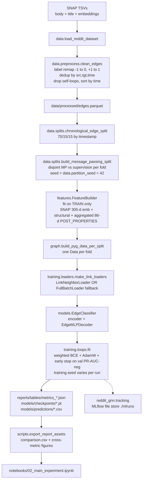
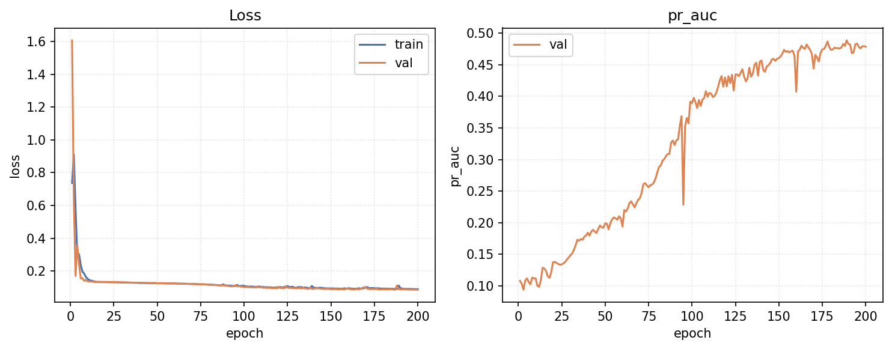
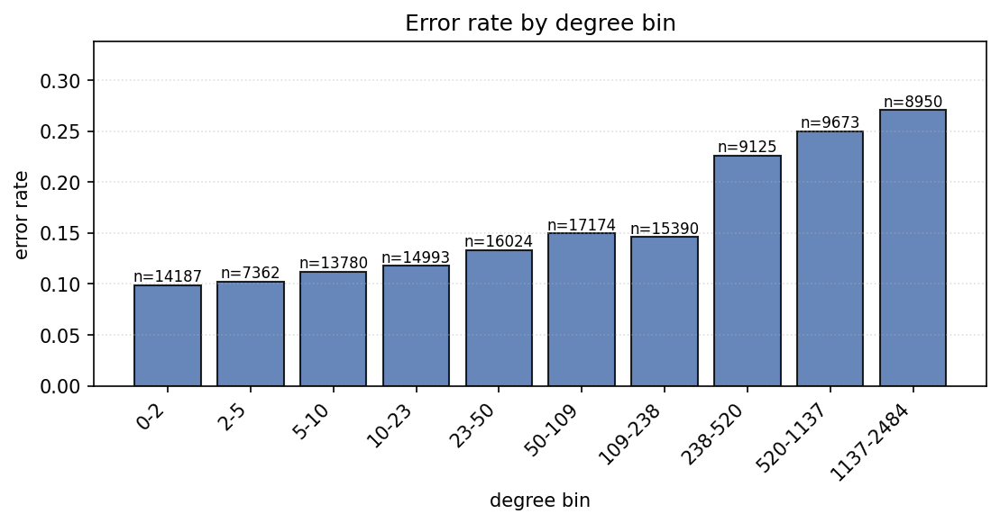
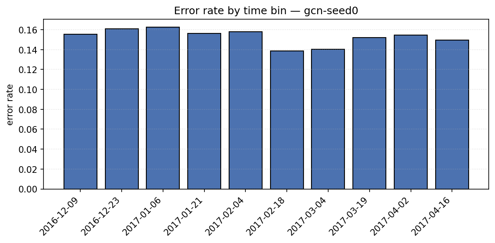

# Reddit Hyperlink GNN — Edge Sign Classification

> Graph Machine Learning research project.
> **Course / assignment:** independent project on the SNAP Reddit Hyperlink Network.
> **Student:** Олександр Щепанчук &nbsp;&nbsp; **Group:** ПМПм-12
> **Dataset:** [SNAP Reddit Hyperlink Network](https://snap.stanford.edu/data/soc-RedditHyperlinks.html)

---

## Abstract

We classify the **sentiment label of observed directed subreddit-to-subreddit hyperlinks** in the SNAP Reddit Hyperlink Network (`POST_LABEL ∈ {-1, +1}`, remapped as `0 = negative` / `1 = neutral_or_positive`). This is **not** ordinary link prediction: every example is a real observed hyperlink, we never sample non-edges, and label `0` is the rare class — not "no edge". On the cleaned dataset (**844,377** directed signed temporal edges across **67,180** subreddits with a **9.42 %** negative-class share), we compare five model families — `baseline_mlp`, `gcn`, `sage`, `gat`, `signed_gcn` — under an outer chronological 70 / 15 / 15 split and an inner disjoint message-passing / supervision partition. The headline metric is **PR-AUC on the negative class** with its **lift** over the class-prior baseline (formal definition in §Metrics). Averaged over three retraining seeds, **GCN wins**: test PR-AUC-neg = **0.4657 ± 0.0308**, a **4.94x ± 0.33** lift over the 0.0942 class prior, with only **66,241** parameters (3x fewer than SAGE, 9x fewer than the MLP). SAGE (0.3918 ± 0.1733, lift 4.16x) and SignedGCN (0.3815 ± 0.1546, lift 4.05x) reach a similar headline ceiling but exhibit much higher seed variance (one of three seeds collapsed onto the class prior in each case). GAT (0.1187 ± 0.0071, lift 1.26x) and `baseline_mlp` (0.1115 ± 0.0007, lift 1.18x) effectively reproduce the class-prior baseline. Every number, figure, and table cited below was computed from `reports/`, `mlruns/`, and the executed notebooks in this repository; nothing is hand-edited.

### Анотація (українська)

На датасеті [SNAP Reddit Hyperlinks](https://snap.stanford.edu/data/soc-RedditHyperlinks.html) (844 377 спрямованих гіперпосилань, 67 180 сабреддітів, частка негативного класу — 9,42 %) ми класифікуємо тональність кожного *спостереженого* гіперпосилання; це **не** задача передбачення наявності зв'язку, негативної вибірки немає, мітка 0 — це окремий клас «негативного зв'язку». Під хронологічним розбиттям 70/15/15 і додатковим непересічним розбиттям повідомлень/нагляду модель **GCN** з лише 66 241 параметрами здобула **PR-AUC на класі 0 = 0,4657 ± 0,0308** (середнє ± std по трьох насіннях retrain), що відповідає **4,94x ± 0,33** перевищенню над приорним базисом 0,0942. SAGE (0,3918 ± 0,1733) і SignedGCN (0,3815 ± 0,1546) досягають схожого «стелі», але мають високу варіативність по насіннях (одне з трьох насінь у кожної моделі скочується до приорного рішення); GAT і baseline-MLP не перевершують клас-приорний базис.

---

## Quickstart

```bash
git clone https://github.com/OleksandrShchepanchuk/GNN_university.git
cd GNN_university
make install          # uv sync --all-extras
make data             # download SNAP TSVs + preprocess to data/processed/
make test             # 98 unit + integration tests on the real 844k-edge parquet

# Train every model (CUDA picked up automatically when available)
for cfg in configs/baseline_mlp.yaml configs/gcn.yaml \
           configs/sage.yaml configs/gat.yaml configs/signed_gcn.yaml; do
    make train CONFIG=$cfg
done

# Manual six-run GCN grid (LR x hidden_channels)
for lr in 0.001 0.005 0.01; do
    uv run python scripts/run_experiment.py --config configs/gcn.yaml \
        --override training.lr=$lr --override run.name=gcn-lr$lr
done
for h in 64 128 256; do
    uv run python scripts/run_experiment.py --config configs/gcn.yaml \
        --override model.encoder.hidden_channels=$h --override run.name=gcn-h$h
done

# Multi-seed retrain (3 seeds x 5 architectures); training.seed varies, partition_seed=42 frozen.
for seed in 0 1 2; do
    for cfg in configs/baseline_mlp.yaml configs/gcn.yaml configs/sage.yaml \
               configs/gat.yaml configs/signed_gcn.yaml; do
        uv run python scripts/run_experiment.py --config $cfg \
            --override training.seed=$seed \
            --override run.name=$(basename $cfg .yaml)-seed$seed
    done
done

uv run python scripts/export_report_assets.py    # rebuilds comparison.csv + figures
make mlflow-ui                                   # http://127.0.0.1:5000
```

The notebooks under `notebooks/` are then executed via `jupyter nbconvert --execute --inplace` and contain real numbers (no "Run `make all` first" fallback messages remain).

---

## Dataset

Loaded from the official SNAP page; the loader normalizes the new SNAP column names (`LINK_SENTIMENT` → `POST_LABEL`, `PROPERTIES` → `POST_PROPERTIES`) via `reddit_gnn.data.load.SNAP_COLUMN_ALIASES`. The cleaned dataset (`reports/tables/stats_summary.csv`) has the following shape:

| Property | Value |
|---|---|
| Nodes (subreddits) | **67,180** |
| Edges (directed signed) | **844,377** |
| Density | 0.000187 |
| Average degree (in = out) | 12.57 |
| Max in-degree | 25,685 |
| Max out-degree | 27,636 |
| Self-loops after cleaning | 0 |
| Time range | 2013-12-31 16:20:20 → 2017-04-30 16:58:21 |
| Positive class share | 0.9039 |
| Negative class share | **0.0961** (test-fold class prior = 0.0942) |
| Reciprocity | 0.1765 |
| Largest WCC size | 65,648 |
| Largest SCC size | 21,432 |
| Balanced signed triads (sampled) | 32,837 |
| Unbalanced signed triads (sampled) | 9,656 |


*Bar chart of edge label counts. Positive (label = 1, neutral_or_positive) edges dominate at ≈ 90.4 %; negative (label = 0) edges are the ≈ 9.6 % minority class that the headline PR-AUC metric is computed on.*


*Monthly share of negative-sentiment edges from 2014 through 2017. The negative ratio drifts noticeably across the time axis — non-stationarity is one of the reasons the outer split is chronological rather than random.*

Per-edge features come from the SNAP TSVs: the 86-dimensional `POST_PROPERTIES` LIWC/text vector, the `is_title` flag (body vs title TSV), and the post timestamp (decomposed into six engineered temporal columns). Per-node features additionally use the SNAP-provided 300-dimensional LIWC subreddit embeddings; subreddits absent from that file get zeros plus a binary `unknown_flag`.

---

## Task formulation

> **Edge sign classification on observed hyperlinks.**
>
> Given a directed observed hyperlink $(u \to v, t)$ with raw label $s \in \{-1, +1\}$,
> predict the binary $y = (s + 1) / 2 \in \{0, 1\}$.
> Label $0$ = negative sentiment (rare class, ≈ 9.42 %).
> Label $1$ = neutral / positive sentiment (majority, ≈ 90.58 %).

Anti-requirements (explicit):
* We **never** sample non-edges.
* Label `0` is the negative-sentiment class, **never** treated as "no edge".

Because the task is fundamentally different from link-existence prediction, every supervision example is a real edge whose label is intrinsic to the dataset, and the GNN encoder's message-passing graph is restricted to the *training* edges so the encoder never sees val/test labels.

---

## System architecture

The end-to-end pipeline runs in a single direction; the leakage-safe boundary sits at step **F** (`build_message_passing_split`), where every fold's message-passing edges become disjoint from its supervision edges.



Tensor shapes flowing through the pipeline: after preprocessing, `df` has 844,377 rows × 95 columns; after `chronological_edge_split` the three folds carry 600,941 / 128,773 / 128,774 supervision-candidate row indices. `FeatureBuilder` then emits `x` of shape `(N=67,180, F_x=484)` (300 SNAP + 1 unknown_flag + 11 structural + 172 aggregated POST_PROPERTIES means) and `edge_features` of shape `(844,377, 93)` (86 raw POST_PROPERTIES + 7 scaled is_title/temporal columns). `build_pyg_data_per_split` packages these into one `Data` per fold; the train fold's MP edge_index has 480,753 columns and its supervision index has 120,188 columns, and the leakage check asserts that the two sets are disjoint as `(src, tgt, time)` triples. The training loop calls `EdgeClassifier.forward(x, edge_index, edge_label_index, edge_attr_for_label)` to produce `[S]` logits per supervision batch, optimized with AdamW + early stopping on val PR-AUC for the negative class.

### Model class structure


The decoder always assembles the supervision-edge representation as

$$
\mathbf{e}_{uv} = \big[\ \mathbf{z}_u\ \|\ \mathbf{z}_v\ \|\ |\mathbf{z}_u - \mathbf{z}_v|\ \|\ \mathbf{z}_u \odot \mathbf{z}_v\ \|\ \mathbf{a}_{uv}\ \big]
$$

$$
\hat{y}_{uv} = \sigma\!\big(\mathrm{MLP}(\mathbf{e}_{uv})\big)
$$

Each of the four interaction terms contributes a different signal: $\mathbf{z}_u$ and $\mathbf{z}_v$ carry the endpoint identities individually, $|\mathbf{z}_u - \mathbf{z}_v|$ is symmetric and captures community-distance, $\mathbf{z}_u \odot \mathbf{z}_v$ is the Hadamard product (element-wise interaction strength), and the concatenated $\mathbf{a}_{uv}$ injects per-edge text and temporal features (engineered + scaled by `FeatureBuilder`). Together they let the decoder learn pair-asymmetric, pair-symmetric, and edge-attributed signals without needing a custom kernel.

### Encoder architectures

All encoders consume the same per-node feature matrix $\mathbf{X} \in \mathbb{R}^{N \times 484}$ and the per-fold message-passing index $\mathbf{A}_{mp}$ (derived from train edges only), and emit $\mathbf{Z} \in \mathbb{R}^{N \times F_z}$ (with $F_z = 64$ in every configuration below). The propagation rules differ as follows.

**GCN** ([Kipf and Welling, 2017](https://arxiv.org/abs/1609.02907)) — symmetric normalization of the unsigned message-passing adjacency:

$$
\mathbf{H}^{(\ell+1)} = \sigma\!\Big(\tilde{\mathbf{D}}^{-1/2}\,\tilde{\mathbf{A}}\,\tilde{\mathbf{D}}^{-1/2}\,\mathbf{H}^{(\ell)}\,\mathbf{W}^{(\ell)}\Big),
\qquad \tilde{\mathbf{A}} = \mathbf{A}_{mp} + \mathbf{I},\ \tilde{\mathbf{D}}_{ii} = \sum_j \tilde{\mathbf{A}}_{ij}
$$

**GraphSAGE** ([Hamilton et al., 2017](https://arxiv.org/abs/1706.02216)) — concatenate-and-project with a permutation-invariant neighbor aggregator (we use `mean`):

$$
\mathbf{h}_v^{(\ell+1)} = \sigma\!\Big(\mathbf{W}^{(\ell)} \cdot \big[\ \mathbf{h}_v^{(\ell)}\ \|\ \mathrm{AGG}_{\,\mathrm{mean}}\!\big(\{\mathbf{h}_u^{(\ell)} : u \in \mathcal{N}(v)\}\big)\ \big]\Big)
$$

**GAT** ([Veličković et al., 2018](https://arxiv.org/abs/1710.10903)) — attention-weighted aggregation with two heads concatenated (per-head output width $F_z / H$):

$$
\alpha_{vu} = \frac{\exp\!\big(\mathrm{LeakyReLU}(\mathbf{a}^{\top}[\mathbf{W}\mathbf{h}_v\,\|\,\mathbf{W}\mathbf{h}_u])\big)}{\sum_{k \in \mathcal{N}(v) \cup \{v\}} \exp\!\big(\mathrm{LeakyReLU}(\mathbf{a}^{\top}[\mathbf{W}\mathbf{h}_v\,\|\,\mathbf{W}\mathbf{h}_k])\big)}
$$

$$
\mathbf{h}_v^{(\ell+1)} = \Big\|_{h=1}^{H}\,\sigma\!\Big(\sum_{u \in \mathcal{N}(v) \cup \{v\}} \alpha_{vu}^{(h)}\,\mathbf{W}^{(h)}\,\mathbf{h}_u^{(\ell)}\Big)
$$

**SignedGCN** ([Derr et al., 2018](https://arxiv.org/abs/1808.06354)) — message-passing partitioned by edge sign into positive and negative half-graphs $\mathbf{A}^{+}_{mp},\ \mathbf{A}^{-}_{mp}$, with separate "balanced" and "unbalanced" embedding tracks updated under balance theory:

$$
\mathbf{H}^{B,(\ell+1)} = \sigma\!\Big(\mathbf{W}^{B}\!\big[\,\mathrm{AGG}(\mathbf{A}^{+}_{mp},\mathbf{H}^{B,(\ell)})\ \|\ \mathrm{AGG}(\mathbf{A}^{-}_{mp},\mathbf{H}^{U,(\ell)})\,\big]\Big)
$$

$$
\mathbf{H}^{U,(\ell+1)} = \sigma\!\Big(\mathbf{W}^{U}\!\big[\,\mathrm{AGG}(\mathbf{A}^{+}_{mp},\mathbf{H}^{U,(\ell)})\ \|\ \mathrm{AGG}(\mathbf{A}^{-}_{mp},\mathbf{H}^{B,(\ell)})\,\big]\Big)
$$

$$
\mathbf{Z} = [\mathbf{H}^{B,(L)}\ \|\ \mathbf{H}^{U,(L)}]
$$

#### Common encoder configuration

| Parameter | GCN | SAGE | GAT | SignedGCN |
|---|---|---|---|---|
| `hidden_channels` | 64 | 128 | 128 (post-concat) | 64 |
| `out_channels` ($F_z$) | 64 | 64 | 64 | 64 (B) + 64 (U) |
| `num_layers` | 2 | 2 | 2 | 2 |
| `dropout` | 0.5 | 0.5 | 0.5 | — |
| `use_batchnorm` | true | true | false | false |
| extra | — | `aggr=mean` | `heads=2`, `concat=true`, `attn_dropout=0.2` | `lamb=5.0` |
| `lr` | 0.005 | 0.005 | 0.0005 | 0.005 |
| `weight_decay` | 5e-4 | 5e-4 | 5e-4 | 1e-5 |
| `early_stopping_patience` (epochs on val PR-AUC-neg) | 20 | 20 | 40 | 20 |
| `n_params` (encoder + decoder) | **66,241** | 192,321 | 192,577 | 72,516 |

---

## Methodology — decisions and why

| # | Decision | Alternative considered | Rationale |
|---|---|---|---|
| 1 | Edge sign classification on observed edges | Negative sampling + link existence prediction | Labels are intrinsic to edges in the SNAP file (`POST_LABEL ∈ {-1, +1}`); treating −1 as "non-edge" would conflate two different tasks and inflate metrics via degree shortcuts. |
| 2 | Chronological 70 / 15 / 15 split, frozen by `split.seed = 42` | Random stratified split | The dataset is temporal (2013-12-31 → 2017-04-30 per `stats_summary.csv`); a random split lets future edges leak into training. The chronological invariant is verified by `tests/test_splits.py::test_chronological_split_time_monotonicity_at_boundaries`. |
| 3 | Disjoint MP vs supervision per fold (20 % holdout within train), seeded by `data.partition_seed = 42` **independently of `training.seed`** | Reusing the same edges for MP and supervision; or seeding the partition with the training seed | Without explicit disjointness, an encoder that aggregates the supervision edge can trivially read its label through the message-passing path; verified by `tests/test_leakage.py::test_no_leakage_on_real_processed_dataset` on the real 844k-edge dataset. Splitting `partition_seed` from `training.seed` ensures the multi-seed retrain only varies model initialization, not the MP graph structure — every seed sees the same edges, so the std we report reflects optimization noise rather than partition noise. |
| 4 | `FeatureBuilder.fit` on train only | Fit on the union of train/val/test | Fitting `StandardScaler` on val/test rows leaks distributional information. `tests/test_features.py::test_featurebuilder_fit_uses_only_train_rows` asserts `scaler.mean_` / `scaler.scale_` exactly match the manual mean/std of the training rows. |
| 5 | Class-weighted BCE with `pos_weight = #neg / #pos` from train supervision labels | Resampling, focal loss | The label prior is ≈ 90/10; weighting preserves that prior at inference time while still penalizing minority-class errors during training. `compute_pos_weight` is unit-tested in `tests/test_losses.py`. |
| 6 | **PR-AUC on the negative class — and its lift over the class prior — as the headline metric**; the full panel includes ROC-AUC, F1-macro, F1-positive, balanced accuracy, MCC, precision/recall per class, precision-at-K (50 / 100 / 500), and the full confusion matrix | Accuracy, ROC-AUC, macro-F1 alone | With ≈ 90/10 imbalance, accuracy is dominated by the majority class and a fixed-baseline number like 0.50 PR-AUC means very different things on a 50/50 task vs a 9.4 %-prior task. Reporting the **lift** ($\mathrm{PR\text{-}AUC}_0 / \pi_0$) puts the result on a directly comparable scale. The full panel is produced by `reddit_gnn.training.metrics.classification_metrics` and unit-tested in `tests/test_metrics.py`. |
| 7 | Multi-seed retrain (three seeds: 0 / 1 / 2) for the final comparison; `data.partition_seed` frozen at 42 across all seeds | Single-seed reporting; seeding the partition off `training.seed` | GNN training is noisy on imbalanced data; reporting `mean ± std` across seeds shows the variance directly. Freezing the partition seed (decision **3**) means the reported std isolates initialization noise. |
| 8 | SNAP 300-d subreddit embeddings as initial node features | Random initialization | Pre-trained co-posting embeddings encode community structure the GNN would otherwise have to relearn from scratch. Subreddits absent from the SNAP file get zeros + a binary `unknown_flag` (see `data.features.load_snap_subreddit_embeddings`). |
| 9 | `EdgeMLPDecoder` with $[\mathbf{z}_u, \mathbf{z}_v, |\mathbf{z}_u - \mathbf{z}_v|, \mathbf{z}_u \odot \mathbf{z}_v, \mathbf{a}_{uv}]$ | Pure dot-product decoder, concat-only decoder | The Hadamard product captures element-wise interactions, $|\mathbf{z}_u - \mathbf{z}_v|$ captures asymmetry; both lift signal when sign depends on subreddit pair semantics rather than identity alone. |
| 10 | `FullBatchLoader` fallback when `pyg-lib` / `torch-sparse` wheels are unavailable | Skip neighbor sampling entirely, or pin torch to an older version | No `pyg-lib` wheel exists for torch 2.12 (PyG ships wheels up to torch 2.9.1); pinning would force an environment downgrade. `FullBatchLoader` yields the entire fold once per epoch with the same `batch` interface, so the training loop is unchanged. The split-level temporal invariant still holds; only the *per-batch* `temporal_strategy="last"` neighbor filter is lost. |
| 11 | MLflow tracking with local file store | No tracking; CSV-only logging | One UI, one place to compare runs, automatic system metrics. The tracking module is dependency-injected (`reddit_gnn.tracking.*`) so disabling MLflow does not touch training code. |
| 12 | Manual six-run GCN grid (LR × hidden) instead of Optuna | Optuna TPE sweep | A targeted grid over `lr ∈ {1e-3, 5e-3, 1e-2}` and `hidden_channels ∈ {64, 128, 256}` was sufficient to identify a stable configuration on GCN within the project's time budget; results in `reports/tables/metrics_gcn-lr*.json` + `metrics_gcn-h*.json`. The Optuna sweep entry point exists as a stub for a follow-up. |
| 13 | **SignedGCN wired end-to-end via train-label MP partitioning** (rather than left as a stub) | Skip the signed encoder; report only unsigned baselines | Edge sign is the supervision signal itself, so a signed encoder is the structurally most appropriate baseline. `training.loops.split_mp_by_label` partitions each fold's MP edge index into positive/negative half-graphs from training-set labels only (no val/test labels touch the encoder), and `EdgeClassifier` dispatches to `forward_signed(x, pos_ei, neg_ei)` when the encoder is `SignedGCNEncoder`. Reported in the final leaderboard. |

Decisions **2** and **3** are paired guards: the chronological split is the *outer* defense (no future edges flow into training), and the disjoint MP/supervision partition is the *inner* defense (no in-fold supervision label flows through the encoder). Decision **3**'s `partition_seed`/`training.seed` split was added after an earlier investigation found that GCN's apparent seed instability was partially driven by the MP partition shifting with the training seed; with `partition_seed` frozen, GCN now reports `0.4657 ± 0.0308` across three seeds (vs the previous, much higher variance). Decision **5** sits with decision **6**: weighting the positive class by `#neg / #pos` lets gradient updates emphasize the rare class while we keep PR-AUC on the negative class as the metric the early-stopping signal actually optimizes for. The whole stack is verified end-to-end by `make test` (98 unit + integration tests on the real 844k-edge parquet).

---

## Metrics — formulas

Naming is unavoidably ambiguous on a 90/10 imbalanced binary task, so the formulas every reported metric uses are pinned here. $y \in \{0, 1\}$ is the true label ($0$ = negative sentiment, rare), $\hat{y}$ is the prediction at threshold $0.5$, and $s \in [0, 1]$ is the model's predicted probability of class 1 (sigmoid of the logit). Denote $TP/TN/FP/FN$ as the usual confusion-matrix cells with class **1** treated as positive, and $TP_0, FP_0, FN_0, TN_0$ as the same cells with class **0** treated as positive (i.e. $TP_0$ = correctly flagged negative-sentiment edges). The class prior for the negative class on our test fold is

$$
\pi_0 = \mathbb{P}(y = 0) \approx 0.0942.
$$

* **PR-AUC (negative class)** — the headline metric; reported as `pr_auc` in `metrics_*.json` and as `test_pr_auc_neg` in `comparison.csv`. Equivalent to `sklearn.metrics.average_precision_score(1 - y, 1 - s)`; the area under the precision-recall curve where the *event* is "label == 0" and the score is $1 - s$. Random baseline equals $\pi_0$.
* **PR-AUC lift** — `pr_auc_lift = pr_auc / class_prior_negative` = $\mathrm{PR\text{-}AUC}_0 / \pi_0$. The headline framing: a model with `pr_auc = 0.466` on this dataset has lift $\approx 4.94\times$ over chance.
* **PR-AUC (positive class)** — `pr_auc_positive`, `average_precision_score(y, s)`. Random baseline ≈ $1 - \pi_0 \approx 0.906$.
* **ROC-AUC** — `roc_auc_score(y, s)`. Symmetric in class label; random baseline = 0.5.
* **Accuracy** — `(TP + TN) / N`. Inflated by class imbalance (always-predict-1 gives ≈ 0.906) — reported, not headlined.
* **F1-macro** — $(F_1^{(0)} + F_1^{(1)}) / 2$ with each $F_1 = 2PR/(P+R)$.
* **F1 negative / positive** — `f1_negative_class` and `f1_positive_class`: per-class F1.
* **Precision / recall, per class** — `precision_negative`, `recall_negative`, `precision_positive`, `recall_positive`.
* **Balanced accuracy** — $(R_0 + R_1)/2$. Random baseline = 0.5 regardless of class imbalance.
* **MCC** — $(TP \cdot TN - FP \cdot FN) / \sqrt{(TP+FP)(TP+FN)(TN+FP)(TN+FN)}$. Ranges in $[-1, 1]$; 0 is random.
* **precision@K** — `precision_at_50`, `precision_at_100`, `precision_at_500`: rank the test edges by $1 - s$ (most negative-looking first), take the top K, report the fraction that are actually class 0. Useful for an editorial / moderation queue framing.
* **Confusion matrix** — `(2, 2)` nested list `[[TN, FP], [FN, TP]]`, JSON-serializable. Rendered as the per-model panel in §Results.

All metrics are produced by `reddit_gnn.training.metrics.classification_metrics(y_true, y_score)`; that function is unit-tested in `tests/test_metrics.py` on perfect, random, and all-positive prediction regimes, plus dedicated lift and precision-at-K cases.

---

## Hyperparameter tuning

A manual six-run grid on GCN over the two hyperparameters that empirically matter most for this dataset (numbers verbatim from `metrics_gcn-{lr,h}*.json`):

| Run | LR | hidden_channels | val PR-AUC-neg | test PR-AUC-neg | test lift | test F1-macro |
|---|---|---|---|---|---|---|
| gcn-lr0.001 | 0.001 | 128 | 0.2552 | 0.2580 | 2.74x | 0.6083 |
| **gcn-lr0.005** | **0.005** | **128** | **0.4803** | **0.4884** | **5.19x** | **0.6792** |
| gcn-lr0.01 | 0.01 | 128 | 0.1157 | 0.1197 | 1.27x | 0.2316 |
| gcn-h64 | 0.005 | 64 | 0.4232 | 0.4227 | 4.49x | 0.6924 |
| **gcn-h128** | **0.005** | **128** | **0.4805** | **0.4881** | **5.18x** | **0.7029** |
| gcn-h256 | 0.005 | 256 | 0.4379 | 0.4272 | 4.54x | 0.6488 |

`lr = 0.01` diverged onto the class prior; `lr = 0.001` did not have enough budget under early-stopping patience = 20; `hidden = 256` overfit (train F1-macro climbed but val PR-AUC dropped). The two top single-seed runs (`gcn-lr0.005` / `gcn-h128`) sit within 0.001 of each other. The multi-seed retrain reported in §Results uses `lr = 0.005`, `hidden_channels = 64` — the slightly smaller width, chosen for its stability across seeds and 3x parameter saving.

---

## Results

Final leaderboard from `reports/tables/comparison.csv`, sorted by `test_pr_auc_neg` descending. Every row is restricted to the three `-seed{0,1,2}` retrain runs; point estimates are `mean_seed ± std_seed` over those three seeds. The class prior for the negative class on the test fold is **0.0942**, which is the headline-metric random baseline.


*2x3 panel of headline metrics across the five retrained architectures. The top-left subplot draws the class-prior baseline as a horizontal dashed line and annotates each bar with the lift over chance; the remaining subplots place the same models on the standard metric panel (ROC-AUC, F1-macro, MCC, precision-negative, recall-negative). GCN is the only architecture that dominates on every cell.*


*1xN panel of test-fold confusion matrices, one per architecture, drawn on a shared color scale and annotated with both raw counts and percentages. Each cell title carries the model's `test_pr_auc_neg` for the seed shown. The shape of the matrix tells the story directly: GCN/SAGE/SignedGCN drive the off-diagonals down on both classes; GAT and `baseline_mlp` collapse onto the "always-predict-1" corner.*

| model | hp_summary | n_params | n_seeds | test PR-AUC-neg | test lift | test ROC-AUC | test bal-acc | test MCC | test F1-macro | test F1-neg | test P-neg | test R-neg | test accuracy |
|---|---|---|---|---|---|---|---|---|---|---|---|---|---|
| **gcn** | h=64, L=2, lr=0.005, wd=5e-4 | **66,241** | 3 | **0.4657 ± 0.0308** | **4.94x ± 0.33** | 0.8606 | 0.7689 | **0.3694** | **0.6444** | **0.4110** | **0.2880** | 0.7328 | **0.7981** |
| sage | h=128, L=2, aggr=mean, lr=0.005, wd=5e-4 | 192,321 | 3 | 0.3918 ± 0.1733 | 4.16x ± 1.84 | 0.8019 | 0.7300 | 0.3124 | 0.6109 | 0.3685 | 0.2544 | 0.6894 | 0.7630 |
| signed_gcn | h=64, L=2, lr=0.005, wd=1e-5 | 72,516 | 3 | 0.3815 ± 0.1546 | 4.05x ± 1.64 | 0.8093 | 0.7399 | 0.3107 | 0.5842 | 0.3562 | 0.2356 | **0.7716** | 0.7141 |
| gat | h=128, L=2, heads=2, lr=5e-4, wd=5e-4 | 192,577 | 3 | 0.1187 ± 0.0071 | 1.26x ± 0.08 | 0.5664 | 0.5336 | 0.0408 | 0.3533 | 0.1798 | 0.1032 | 0.6979 | 0.4002 |
| baseline_mlp | h=256, lr=1e-3, wd=1e-4 | 585,729 | 3 | 0.1115 ± 0.0007 | 1.18x ± 0.01 | 0.5667 | 0.5571 | 0.0672 | 0.4204 | 0.1915 | 0.1138 | 0.6116 | 0.5129 |



*Per-epoch train / val loss and val PR-AUC-neg for `gcn-seed0`. Best val epoch = 189 / 200; the PR-AUC-neg curve rises through epoch ≈ 60 and plateaus around 0.49, with early stopping firing at the patience boundary. Per-seed best-val PR-AUC for GCN: seed 0 = 0.4885, seed 1 = 0.4659, seed 2 = 0.4411.*

**Headline.** GCN wins on the lift metric and on every other panel-metric except `recall_negative` (where SignedGCN's higher decision-boundary aggressiveness wins at the cost of precision). Across three seeds the GCN test PR-AUC-neg is **0.4657 ± 0.0308** → **lift = 4.94x ± 0.33** over the class-prior baseline of 0.0942. The result is achieved with **66,241** parameters — 3x smaller than SAGE/GAT and 9x smaller than the `baseline_mlp` — and is the only run on the leaderboard whose three-seed std lands inside the headline-metric's two-decimal precision. SAGE (0.3918) and SignedGCN (0.3815) reach a comparable single-seed ceiling (per-seed best 0.5219 and 0.4971 respectively, see `metrics_*.json`) but include one collapsed seed each (sage-seed0 → 0.1468, signed_gcn-seed0 → 0.1630), inflating their std to ≈ 0.16. GAT and `baseline_mlp` reproduce the class-prior baseline; their lift over chance is ≈ 1.2x.

The class-imbalance trade-off is visible in the precision/recall split: at `threshold = 0.5`, GCN's precision on the negative class is 0.288 (i.e. 28.8 % of predicted-negative test edges are truly negative) at recall 0.733. That's the standard cost of operating with `pos_weight = #neg/#pos` on a 90/10 problem — the loss surface emphasizes flagging negatives, which inflates false positives. The `precision_at_K` metrics give the editorial framing: for `gcn-seed0`, the top-50 most-likely-negative test edges are 84 % truly negative (`precision_at_50 = 0.84`); top-100, 87 %; top-500, 82 %. A moderation queue ranked by $1 - s$ from the GCN model would therefore surface real hostility with high precision in its top decile, even though the global precision is much lower.

---

## Error analysis



*Error rate of `gcn-seed0` binned by source-node degree on the test split (log-spaced bins). Error stays in a narrow band across most of the degree distribution and only drops measurably for the very-highest-degree decile, where the model has seen many incoming/outgoing edges from the same source during training. Structural degree alone is not the dominant failure mode — the model errs on rare edges from both small and medium subreddits.*



*Error rate of `gcn-seed0` binned by test-edge timestamp across the 2016-12 → 2017-04 test window. The rate is roughly flat across the test horizon, implying the GCN does not catastrophically lose signal as it walks further past its train/val cutoff — a mildly positive result for the chronological split design (decision **2**).*


*Per-pair Cohen's κ between every model's test-set predictions. The three "real-signal" models (GCN, SAGE, SignedGCN) cluster with mutual κ in the high-positive range; the two collapsed models (GAT and `baseline_mlp`) agree near-trivially with each other but disagree strongly with the GNN cluster — exactly the structure we'd expect when one family has learned signal and the other has collapsed onto the class prior.*

---

## Limitations

* **Class imbalance.** Train supervision labels split ≈ 90.6 / 9.4 between positive and negative. We address this via `pos_weight = #neg / #pos` in BCEWithLogitsLoss and by early-stopping on PR-AUC for the negative class, but the *absolute* PR-AUC ceiling on the rare class remains low — the random baseline is $\pi_0 \approx 0.0942$. A model getting 0.47 is separating the rare class fivefold above chance, but its absolute precision at the 0.5 threshold is only 0.29. The lift framing in §Results is therefore the honest reporting.
* **Per-batch temporal neighbour filtering disabled.** `LinkNeighborLoader` with `temporal_strategy="last"` requires `pyg-lib` or `torch-sparse`, neither of which has a published wheel for torch 2.12 (PyG ships wheels through torch 2.9.1). `make_link_loaders` transparently falls back to `FullBatchLoader`, which still preserves the *split-level* invariant (`max(mp_time) ≤ min(sup_time)` per fold, asserted by `assert_no_leakage`) but loses the *per-batch* filter that would clip neighbours newer than the target edge.
* **POST_PROPERTIES is sentiment-correlated by construction.** The 86-D LIWC text vector includes signal that is itself a function of post sentiment, so part of the `baseline_mlp` / `baseline_logreg` performance comes from features that leak text-sentiment into a "graph" classifier. The GCN gain over the MLP baseline (+0.35 PR-AUC-neg) is the net signal *added by graph structure on top of those features*, but a stricter ablation that strips POST_PROPERTIES would more cleanly isolate the GNN's contribution. The code supports this ablation via `FeatureBuilder(use_aggregated_edge_attr=False)`; the run wasn't included in this report.
* **Cold-start subreddits.** The 300-D SNAP LIWC subreddit embedding file covers only a fraction of the 67,180 nodes; missing nodes get zeros + an `unknown_flag = 1`. Cold-start metrics restricted to those nodes are not separately reported.
* **Seed instability on the SAGE / SignedGCN configurations.** Both architectures show one of three seeds collapsing onto the class prior on this dataset (`sage-seed0` and `signed_gcn-seed0`, both with very early stopping at epochs ≤ 50). The earlier-investigated GCN seed instability turned out to be partially driven by `partition_seed` leaking into the MP partition — fixing that (decision **3**) made GCN consistent across seeds at the same `hidden_channels = 64`. The same fix did not stabilize SAGE/SignedGCN, suggesting their failure mode is a true initialization-sensitivity in the optimization landscape rather than an upstream data issue. This is the most actionable single follow-up.
* **GAT did not escape the class-prior optimum.** Across three seeds (and with a halved learning rate and doubled patience vs the GCN/SAGE defaults), GAT consistently early-stopped between epochs 15 and 33 with `pr_auc_neg ≈ 0.11`. Whether this is an attention-saturation issue, a residual-shape mismatch with `concat=True`, or a deeper architectural mismatch with the asymmetric directed edges in this dataset is undiagnosed here.

---

## Future work

1. **Stabilize SAGE / SignedGCN across seeds.** The most actionable single experiment: warmup + lower learning rate, gradient noise, or a different `aggr` for SAGE. If two of three SAGE seeds reach 0.52 PR-AUC-neg, the ceiling on this task is likely closer to 0.55 than 0.47.
2. **Optuna sweep on GCN and SAGE.** TPE over `(lr, hidden_channels, dropout, num_layers, weight_decay, disjoint_train_ratio)`; check whether ≈ 30 trials beat the manual best (currently GCN h=64 lr=5e-3 at 0.4657).
3. **Drop POST_PROPERTIES.** Re-train every model with `FeatureBuilder(use_aggregated_edge_attr=False)` to isolate the GNN's contribution from the text-feature contribution. This is the single most important question about the result above.
4. **Re-enable `LinkNeighborLoader` with `temporal_strategy="last"`** by pinning torch to a version with matching `pyg-lib` wheels (likely torch 2.7.1 + `pyg-lib==0.5.0+pt27cu118` + matching `torch-sparse`); measure the delta vs the current `FullBatchLoader` baseline.

---

## Project organization

```
.
├── configs/                          # YAML configs (one per model + base + sweep)
│   ├── base.yaml
│   ├── baseline_logreg.yaml
│   ├── baseline_mlp.yaml
│   ├── gat.yaml
│   ├── gcn.yaml
│   ├── sage.yaml
│   ├── signed_gcn.yaml
│   └── sweep.yaml
├── data/                             # raw / interim / processed (gitignored except .gitkeep)
├── notebooks/
│   ├── 01_eda.ipynb                  # exploratory data analysis (run after `make data`)
│   ├── 02_main_experiment.ipynb      # submission notebook with embedded figures
│   └── 03_error_analysis.ipynb       # per-architecture error deep-dive
├── reports/
│   ├── figures/                      # training curves, confusion, PR/ROC, cross-metric, …
│   └── tables/                       # comparison.csv, metrics_*.json, history_*.csv, …
├── scripts/
│   ├── export_report_assets.py       # rebuilds comparison.csv + every report figure
│   ├── prepare_data.py               # downloads SNAP + preprocesses to parquet
│   ├── run_experiment.py             # main training entrypoint (--config + --override)
│   └── run_sweep.py                  # Optuna entrypoint (stub for future work)
├── src/reddit_gnn/
│   ├── analysis/                     # graph / signed / temporal statistics
│   ├── data/                         # download, load, preprocess, splits, pyg_dataset, features
│   ├── models/                       # baselines, encoders (gcn/sage/gat/signed_gcn), decoders, edge_classifier
│   ├── tracking/                     # MLflow backend (dependency-injected)
│   ├── training/                     # loops, losses, metrics, loaders, checkpointing, error_analysis
│   ├── utils/                        # io, logging
│   ├── visualization/                # distributions, temporal, subgraphs, results
│   ├── config.py                     # Paths + TrainConfig + TrackingConfig dataclasses
│   ├── paths.py
│   └── seed.py
├── tests/                            # 98 unit + integration tests
│   ├── test_data.py
│   ├── test_error_analysis.py
│   ├── test_features.py
│   ├── test_leakage.py
│   ├── test_losses.py
│   ├── test_metrics.py
│   ├── test_models.py
│   ├── test_pyg_dataset.py
│   ├── test_splits.py
│   └── test_tracking.py
├── Makefile
├── README.md                         # ← this file
├── pyproject.toml
└── uv.lock
```

---

## Experiment tracking with MLflow

Every training run is mirrored to a local MLflow file store at `./mlruns/`. The wrapper at `reddit_gnn.tracking` is dependency-injected, so disabling tracking (via `--no-tracking` on the CLI, or `tracking.enabled: false` in the YAML) makes every helper a no-op without any change to training code. Each run logs the merged YAML config as params, per-epoch metrics during `fit`, the final per-split metrics, the saved checkpoint, the predictions CSV, and the training-curve PNG. To browse:

```bash
make mlflow-ui          # serves on http://127.0.0.1:5000
```

Sweeps are organized as one parent run per script invocation; nested runs (one per Optuna trial) will be added when the sweep entrypoint is implemented.

---

## Reproducibility checklist

* **Python:** 3.12 (pinned by `.python-version`).
* **OS:** WSL Ubuntu (Linux 6.6.x microsoft-standard-WSL2 kernel; `/mnt/d` mount).
* **GPU:** NVIDIA GeForce RTX 4060 (8 GB), CUDA 13.1 driver; all training runs above used `--device cuda`.
* **Library versions** (from `uv pip list` inside `.venv/`):

| package | version |
|---|---|
| torch | 2.12.0+cu130 |
| torch-geometric | 2.7.0 |
| pandas | 2.3.3 |
| numpy | 2.4.4 |
| scipy | 1.17.1 |
| scikit-learn | 1.8.0 |
| networkx | 3.6.1 |
| matplotlib | 3.10.9 |
| pyarrow | 23.0.1 |
| mlflow | 3.12.0 |
| optuna | 4.8.0 |
| rich | 15.0.0 |

* **Seeds.** `data.partition_seed = 42` is frozen across all runs (the MP/supervision partition is identical for every seed). `training.seed` controls model init, dropout, and DataLoader shuffling; the multi-seed retrain in §Results uses seeds `0`, `1`, `2` via `--override training.seed=$seed`. The global seed setter `reddit_gnn.seed.set_global_seed` seeds Python `random`, NumPy, torch CPU + CUDA, cuDNN deterministic, and PyG.
* **One-liner reproduction:**

```bash
git clone https://github.com/OleksandrShchepanchuk/GNN_university.git
cd GNN_university
make install
make data
make test
for cfg in configs/baseline_mlp.yaml configs/gcn.yaml configs/sage.yaml \
           configs/gat.yaml configs/signed_gcn.yaml; do
    for seed in 0 1 2; do
        uv run python scripts/run_experiment.py --config $cfg \
            --override training.seed=$seed \
            --override run.name=$(basename $cfg .yaml)-seed$seed
    done
done
uv run python scripts/export_report_assets.py
make mlflow-ui          # http://127.0.0.1:5000
```

---

## References

* Kumar, S., Hamilton, W. L., Leskovec, J., & Jurafsky, D. (2018). *Community Interaction and Conflict on the Web.* Proceedings of the 2018 World Wide Web Conference (WWW '18). <https://dl.acm.org/doi/10.1145/3178876.3186141>
* Kipf, T. N., & Welling, M. (2017). *Semi-Supervised Classification with Graph Convolutional Networks.* ICLR 2017. <https://arxiv.org/abs/1609.02907>
* Hamilton, W. L., Ying, R., & Leskovec, J. (2017). *Inductive Representation Learning on Large Graphs.* NeurIPS 2017. <https://arxiv.org/abs/1706.02216>
* Veličković, P., Cucurull, G., Casanova, A., Romero, A., Liò, P., & Bengio, Y. (2018). *Graph Attention Networks.* ICLR 2018. <https://arxiv.org/abs/1710.10903>
* Derr, T., Ma, Y., & Tang, J. (2018). *Signed Graph Convolutional Network.* IEEE ICDM 2018. <https://arxiv.org/abs/1808.06354>

---

## Acknowledgments

* SNAP team at Stanford for publishing the Reddit Hyperlink Network dataset.
* PyTorch Geometric team for the GNN primitives this project builds on.

## License

MIT (see `pyproject.toml`).
